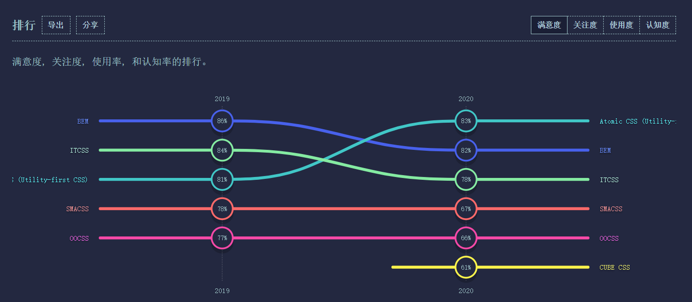
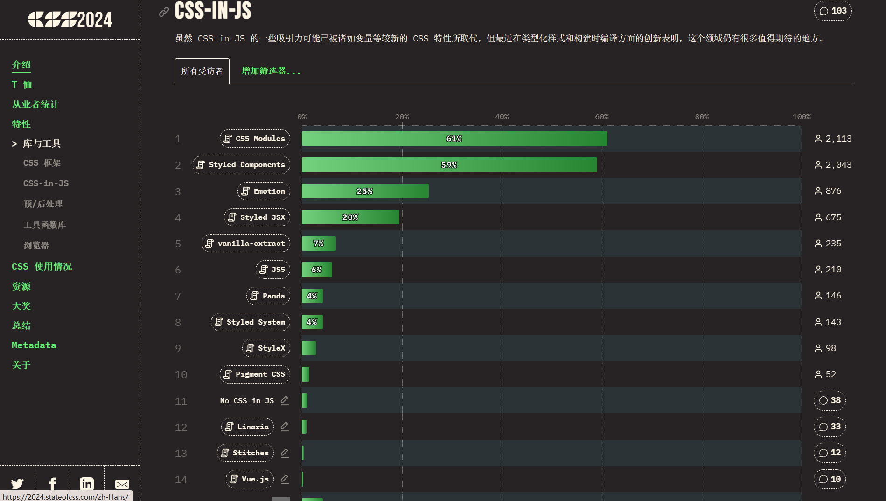
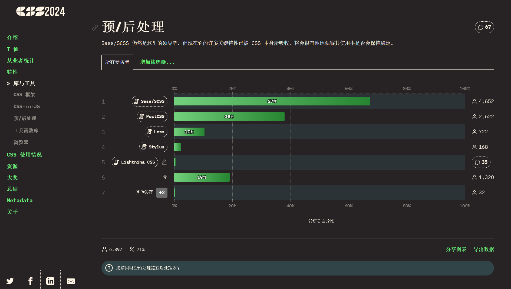

# CSS工程化

## 概述

有关CSS的现状统计可以参考 https://stateofcss.com/en-US，其中包含每个年份的调查情况（从2019开始）

### css的问题

1. 类名冲突的问题

   当你写一个css类的时候，你是写全局的类呢，还是写多个层级选择后的类呢？

   你会发现，怎么都不好

   - 过深的层级不利于编写、阅读、压缩、复用
   - 过浅的层级容易导致类名冲突

   一旦样式多起来，这个问题就会变得越发严重，其实归根结底，就是类名冲突不好解决的问题

2. 重复样式

   这种问题就更普遍了，一些重复的样式值总是不断的出现在css代码中，维护起来极其困难

   比如，一个网站的颜色一般就那么几种：

   - primary
   - info
   - warn
   - error
   - success

   如果有更多的颜色，都是从这些色调中自然变化得来，可以想象，这些颜色会到处充斥到诸如背景、文字、边框中，一旦要做颜色调整，是一个非常大的工程

3. css文件细分

   在大型项目中，css也需要更细的拆分，这样有利于css代码的维护。

   比如，有一个做轮播图的模块，它不仅需要依赖js功能，还需要依赖css样式，既然依赖的js功能仅关心轮播图，那css样式也应该仅关心轮播图，由此类推，不同的功能依赖不同的css样式、公共样式可以单独抽离，这样就形成了不同于过去的css文件结构：文件更多、拆分的更细

   而同时，在真实的运行环境下，我们却希望文件越少越好，这种情况和JS遇到的情况是一致的

   因此，对于css，也需要工程化管理

   从另一个角度来说，css的工程化会遇到更多的挑战，因为css不像JS，它的语法本身经过这么多年并没有发生多少的变化（css3也仅仅是多了一些属性而已），对于css语法本身的改变也是一个工程化的课题

### 解决

1. 命名冲突的问题

   * 命名约定

     提供一个命名标准，来解决冲突，常用的标准（都是民间的，官方不解决）有：

     * [BEM](https://getbem.com/)

       全称"Block Element Modifier"，也就是"块，元素，修饰符"，它的核心思想是 **通过组件名的唯一性来保证选择器的唯一性，从而保证样式不会污染到组件外**。

       ```html
       <-- 示例 -->
       <nav class="nav"> 
           <ul class="nav__list"> 
               <li class="nav__item nav__item--active"> 
                   <a href="/about" class="nav__link">About</a> 
               </li> 
               <li class="nav__item"> 
                   <a href="/pricing" class="nav__link">Pricing</a> 
               </li> 
               <li class="nav__item"> 
                   <a href="/contact" class="nav__link">Contact</a> 
               </li> 
           </ul> 
       </nav>
       ```
   
       1. **区块 / Block：** 代表页面中独立且可复用的底层组件。
       2. **元素 / Element：** Block 内部的组成元素，通常用于定义块的内部结构和样式。就像是各种家具、装饰品等，它们的存在才让一个空间与众不同。
       3. **修饰符 / Modifier：** 用于改变 Block 或 Element 的外观和行为。比如灯有打开和关闭两种状态，“开”和“闭”就是“灯”这个元素的修饰符。
   
     * OOCSS
   
       全称"Object-Oriented CSS"，也就是"面向对象CSS"，主要是通过抽象将CSS进行模块化，提高代码的复用性和可维护性。
   
       可以参考这篇文章：[CSS 架构之OOCSS](https://juejin.cn/post/7021067874139635726)
   
       其实在平常开发中，我们也会不知不觉的用上这种方式，只是不知道它叫"OOCSS":
   
       示例 =>
   
       ```html
       <!DOCTYPE html>
       <html lang="en">
         <head>
           <meta charset="UTF-8" />
           <meta name="viewport" content="width=device-width, initial-scale=1.0" />
           <title>Document</title>
           <style>
             .box-border {
               border: 1px dashed #ccc;
               border-radius: 6px;
             }
       
             .box-1 {
               width: 100px;
               height: 100px;
             }
       
             .box-2 {
               width: 120px;
               height: 120px;
             }
           </style>
         </head>
         <body>
           <div class="box-border box-1"></div>
           <div class="box-border box-2"></div>
         </body>
       </html>
       ```
   
     * [SMACSS](https://smacss.com/) 网友翻译的中文站点：[SMACSS-ZH](https://smacss-zh.vercel.app/)
   
       全称"Scalable and Modular Architecture for CSS"，就是"CSS的可扩展和模块化架构"。
   
       可以参考这篇文章：[CSS 架构之 SMACSS](https://juejin.cn/post/7021803661890174989)
   
       它把CSS拆成五个部分：base（基础）、layout（布局）、module（模块）、state（状态）、theme（主题）。
   
       `base`：定义全局性初始化默认样式，比如说：reset.css（统一重置浏览器部分的默认样式）
   
       `layout`：定义了页面的主要布局结构，例如头部、主内容区和页脚等，用于定义页面的主要区域，而这类的css命名通常以`.l-`开头
   
       `module`：定义了可复用的独立组件样式，通常是定义局部的特定组件样式。
   
       `state`：定义了不同状态下的样式变化，例如悬停、激活等。状态样式通常是动态的，用于描述组件在不同状态下的样式，而这类的css命名通常以`.is-`来开头。
   
       `theme`：主题样式定义了不同主题的样式变化，例如深色主题、浅色主题等，主题样式往往是全局的，用于定义整个网站的主题样式。特殊情况下，组件库中每种按钮都有一种主题（primary, info, success等等），但它是局部的，所以要以实际的场景思考。
   
     * [ACSS](https://acss-io.github.io/atomizer/)
   
       全称"Atomic CSS"，也叫"原子化 CSS"，它的核心思想是：不强调**逻辑**，而更侧重表现的一门**所见即所得**的语言，将 CSS 属性写成一个独立的类名。
   
       可以参考这篇文章：[CSS 架构之 ACSS](https://juejin.cn/post/7024007157221687304)
   
       示例：
   
       ```HTML
       <!DOCTYPE html>
       <html lang="en">
         <head>
           <meta charset="UTF-8" />
           <meta name="viewport" content="width=device-width, initial-scale=1.0" />
           <title>Document</title>
           <style>
             .w-120px {
               width: 120px;
             }
       
             .h-120px {
               height: 120px;
             }
       
             .text-center {
               text-align: center;
             }
       
             .leading-8 {
               line-height: 2rem;
             }
       
             .ml-10 {
               margin-left: 10px;
             }
       
             .border-2 {
               border-width: 2px;
             }
       
             .border-dashed {
               border-style: dashed;
             }
       
             .border-red-200 {
               border-color: rgb(254 202 202);
             }
           </style>
         </head>
         <body>
           <div
             class="w-120px h-120px text-center leading-8 ml-10 border-2 border-dashed border-red-200"
           >
             Hello world!
           </div>
         </body>
       </html>
       
       ```
   
       实际情况下，每个CSS 属性作为一个类名不可能全部自己手写，所以会借助第三方“原子化框架”，著名的有: [tailwindcss](https://www.tailwindcss.cn/)、[unocss](https://unocss.nodejs.cn/)，使用这种css命名规范开发效率会变得更快，也会很少写新的css，灵活，易读，永远不用担心命名冲突，永远不用担心样式覆盖。但是劣势在于需要一定的学习成本，HTML体积会变大
   
     等等。
   
     下面这是2020年受欢迎的CSS方法论（在后面年份的CSS调查中没有统计）：
   
     
   
   * `css in js`
   
     这种方案非常大胆，它觉得，css语言本身几乎无可救药了，干脆直接**用js对象来表示样式，然后把样式直接应用到元素的style中**。
   
     这样一来，css变成了一个一个的对象，就可以完全利用到js语言的优势，你可以：
   
     - 通过一个函数返回一个样式对象
     - 把公共的样式提取到公共模块中返回
     - 应用js的各种特性操作对象，比如：混合、提取、拆分
     - 更多的花样
   
     > 这种方案在手机端的React Native大行其道
   
     下面使用一个简单的例子来做到`css in js`
   
     ```javascript
     const box = document.createElement('div')
     const styles = {
       backgroundColor: "#f40",
       color: "#fff",
       width: "30%",
       height: "80%",
       margin: "0 auto",
     }
     Object.assign(box.style, styles)
     ```
   
     下面是2024年`css in js`的使用统计情况：
   
     
   
     从广义的角度来说`CSS Modules`，也属于`css in js`的实现方式之一，这里暂时不讨论`CSS Modules`，使用`css in js`的最多的三个库分别是：
   
     `Styled Components`、`Emotion`、`Styled JSX`
   
   * `css modules`
   
     通过构建工具对 CSS 类名进行自动化局部化处理，实现样式的**隔离作用域**，它是一种用于解决传统 CSS **全局作用域污染**和**样式冲突**问题的模块化CSS管理方案。
   
     有关`css modules`的示例，可以查看 [css-modules](https://github.com/css-modules/css-modules) 仓库的示例 [Get Started & Examples](https://github.com/css-modules/css-modules/blob/master/docs/get-started.md)
   
     后面小节会详细的在`webpack`中使用 `css modules`
   
2. 重复样式

   * `css in js`

     上面有提到这个方案，由于JavaScript有极高的灵活性，可以通过将样式**面向对象编程**，来解决重复样式的问题。

   * `CSS预/后处理器`

     * `CSS 预处理器`：一种通过**扩展CSS语法**并提供**编程式能力**的工具，通过将工具中的高级语法编译转化成标准的CSS，从而兼容浏览器环境。

       比如`CSS 预处理器`的一个流行库：`Sass`，它可以通过高级语法：变量，嵌套，混入，继承，模块，工具/自定义函数等方式来解决CSS样式重复的问题

     * `CSS 后处理器`：一种对**已生成的 CSS 文件**进行**优化、转换或增强**的工具。其核心目标是通过**自动化处理**提升 CSS 的兼容性、性能或可维护性。与 CSS 预处理器（如 Sass/Less）不同，后处理器作用于 CSS 的“下游”阶段，直接处理标准的 CSS 代码。

       比如`CSS 后处理器`的基石（最主流，没有之一）：`PostCss`，它作为一个插件化平台，不仅仅通过插件能够做到：浏览器厂商的CSS兼容、CSS未来语法（CSS草案）兼容等和重复样式无关的功能，也可以通过 [PostCss 语言扩展插件集合](https://postcss.nodejs.cn/docs/postcss-plugins#language-extensions) 来实现：变量（**[postcss-simple-vars](https://github.com/postcss/postcss-simple-vars)**）、嵌套（[postcss-nested](https://github.com/postcss/postcss-nested)）、混入（[postcss-mixins](https://github.com/postcss/postcss-mixins)）等等解决重复样式的高级语法。

     下面是2024年`CSS预/后处理器`的使用统计情况：

     可以看到**CSS预处理器**使用最多的是：`Sass/Scss`、`Less`、`Stylus`，**CSS后处理器**使用最多的是：`PostCSS`、`Lightning CSS`

3. 解决CSS文件细分问题

   解决细分问题，需要依靠构建工具，比如说：`webpack`、`vite`，来进行打包、合并、压缩。当然上面提到的一些方案可能做一些处理...

   后面小节中`webpack`会对文件细分进行处理，包含：多CSS文件合并、CSS文件压缩、CSS文件单独打包

### 代码示例

| 解决方案名称 - 示例 | 类型     | 代码路径         |
| ------------------- | -------- | ---------------- |
| BEM                 | 命名约定 | /concept/BEM     |
| css in js           | 无       | /concept/CssInJs |
| Sass                | 预处理器 | /concept/Sass    |
| PostCss             | 后处理器 | /concept/PostCss |

## Webpack模块化CSS引入JS中

因为webpack的模块化系统基于JS，所以要做到**拆分CSS**，必须要让Webpack可以解析CSS文件，而使用loader可以满足这种条件（能够将CSS的代码转换为JS的代码）。

### css-loader

默认情况下，在JavaScript中导入CSS，它会不识别其语法而报错。

在使用`css-loader`后它会**将CSS代码作为字符串导出** (核心思想)，当然它还会处理一些特殊情况：url()、@import等CSS依赖导入问题，`css-loader`是通过**将css中的其他依赖作为require导入**。

**普通的例子：**

CSS文件

```CSS
.red {
    color: red;
}
```

转换后的JS代码

```JavaScript
module.exports = `.red {
	color: red;
}`
```

**特殊的例子：**

CSS文件

```CSS
@import "reset.css";
.box {
    color: red;
    background-image: url('./bg.png');
}
```

转换后的JS代码

```javascript
var import1 = require("./reset.css");
var import2 = require("./bg.png");
module.exports = `
${import1}
.box {
	color: red;
	background-image: url(${import2});
}
`
```

### style-loader

style-loader的核心思想是**通过JS的DOM操作将css-loader导出的字符串加入到页面的style元素中**。

例子：

```JavaScript
// 通过css-loader导出的字符串
module.exports = `
.box {
	width: 100px;
	height: 100px;
	color: red;
}
`
```

经过style-loader转换后变成：

```JavaScript
module.exports = `
.box {
	width: 100px;
	height: 100px;
	color: red;
}
`
var style = module.exports;
var styleSheet = document.createElement("style")
styleSheet.innerText = styleSheet
document.head.appendChilden(styleSheet)
module.exports = {}
```

:::details 代码内容

代码内容详情请看：`01-模块化css引入js中`

:::

## 抽离CSS

## CSS Module
