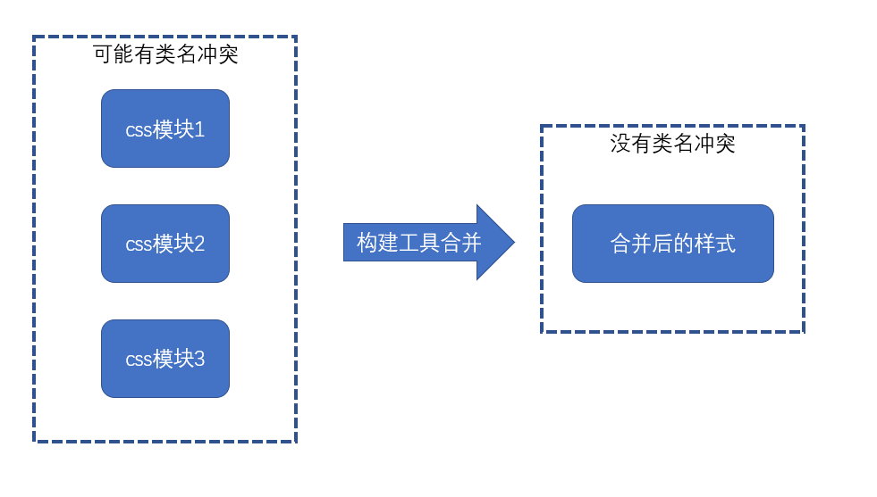
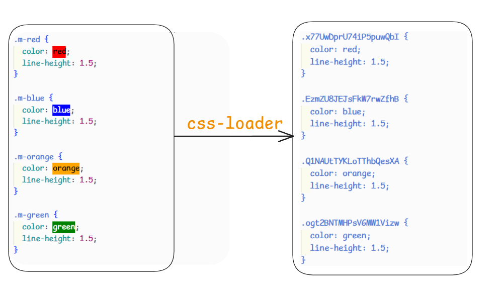
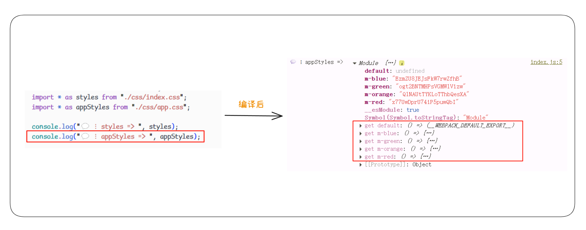
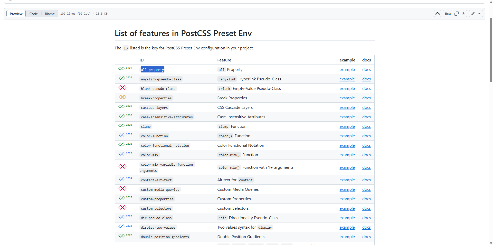
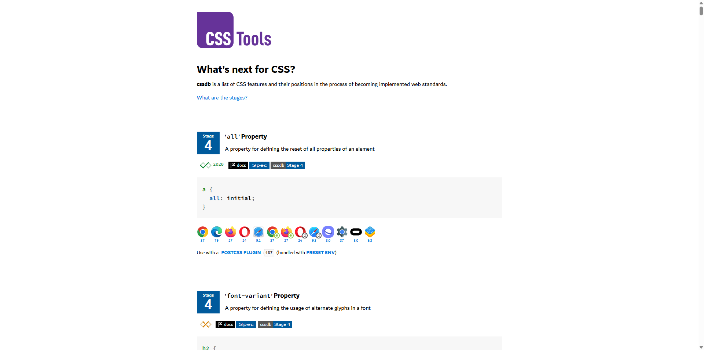
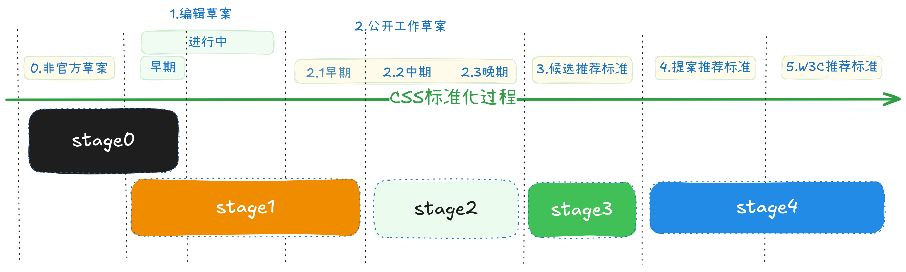

# CSS工程化

## 概述

有关CSS的现状统计可以参考[State of CSS](https://stateofcss.com/en-US) ，其中包含每个年份的调查情况（从2019开始）

### css的问题

1. 类名冲突的问题

   当你写一个css类的时候，你是写全局的类呢，还是写多个层级选择后的类呢？

   你会发现，怎么都不好

   - 过深的层级不利于编写、阅读、压缩、复用
   - 过浅的层级容易导致类名冲突

   一旦样式多起来，这个问题就会变得越发严重，其实归根结底，就是类名冲突不好解决的问题

2. 重复样式

   这种问题就更普遍了，一些重复的样式值总是不断的出现在css代码中，维护起来极其困难

   比如，一个网站的颜色一般就那么几种：

   - primary
   - info
   - warn
   - error
   - success

   如果有更多的颜色，都是从这些色调中自然变化得来，可以想象，这些颜色会到处充斥到诸如背景、文字、边框中，一旦要做颜色调整，是一个非常大的工程

3. css文件细分

   在大型项目中，css也需要更细的拆分，这样有利于css代码的维护。

   比如，有一个做轮播图的模块，它不仅需要依赖js功能，还需要依赖css样式，既然依赖的js功能仅关心轮播图，那css样式也应该仅关心轮播图，由此类推，不同的功能依赖不同的css样式、公共样式可以单独抽离，这样就形成了不同于过去的css文件结构：文件更多、拆分的更细

   而同时，在真实的运行环境下，我们却希望文件越少越好，这种情况和JS遇到的情况是一致的

   因此，对于css，也需要工程化管理

   从另一个角度来说，css的工程化会遇到更多的挑战，因为css不像JS，它的语法本身经过这么多年并没有发生多少的变化（css3也仅仅是多了一些属性而已），对于css语法本身的改变也是一个工程化的课题

### 解决

命名冲突的问题可以被命名约定来解决。

#### 命名约定

提供一个命名标准，来解决冲突，常用的标准（都是民间的，官方不解决）有：

##### [BEM](https://getbem.com/)

全称"Block Element Modifier"，也就是"块，元素，修饰符"，它的核心思想是 **通过组件名的唯一性来保证选择器的唯一性，从而保证样式不会污染到组件外**。

```html
<-- 示例 -->
<nav class="nav"> 
    <ul class="nav__list"> 
        <li class="nav__item nav__item--active"> 
            <a href="/about" class="nav__link">About</a> 
        </li> 
        <li class="nav__item"> 
            <a href="/pricing" class="nav__link">Pricing</a> 
        </li> 
        <li class="nav__item"> 
            <a href="/contact" class="nav__link">Contact</a> 
        </li> 
    </ul> 
</nav>
```

1. **区块 / Block：** 代表页面中独立且可复用的底层组件。
2. **元素 / Element：** Block 内部的组成元素，通常用于定义块的内部结构和样式。就像是各种家具、装饰品等，它们的存在才让一个空间与众不同。
3. **修饰符 / Modifier：** 用于改变 Block 或 Element 的外观和行为。比如灯有打开和关闭两种状态，“开”和“闭”就是“灯”这个元素的修饰符。

##### OOCSS

全称"Object-Oriented CSS"，也就是"面向对象CSS"，主要是通过抽象将CSS进行模块化，提高代码的复用性和可维护性。

可以参考这篇文章：[CSS 架构之OOCSS](https://juejin.cn/post/7021067874139635726)

其实在平常开发中，我们也会不知不觉的用上这种方式，只是不知道它叫"OOCSS":

示例 =>

```html
<!DOCTYPE html>
<html lang="en">
  <head>
    <meta charset="UTF-8" />
    <meta name="viewport" content="width=device-width, initial-scale=1.0" />
    <title>Document</title>
    <style>
      .box-border {
        border: 1px dashed #ccc;
        border-radius: 6px;
      }

      .box-1 {
        width: 100px;
        height: 100px;
      }

      .box-2 {
        width: 120px;
        height: 120px;
      }
    </style>
  </head>
  <body>
    <div class="box-border box-1"></div>
    <div class="box-border box-2"></div>
  </body>
</html>
```

##### [SMACSS](https://smacss.com/)

全称"Scalable and Modular Architecture for CSS"，就是"CSS的可扩展和模块化架构"。

可以参考这篇文章：[CSS 架构之 SMACSS](https://juejin.cn/post/7021803661890174989);网友翻译的中文站点：[SMACSS-ZH](https://smacss-zh.vercel.app/)

它把CSS拆成五个部分：base（基础）、layout（布局）、module（模块）、state（状态）、theme（主题）。

`base`：定义全局性初始化默认样式，比如说：reset.css（统一重置浏览器部分的默认样式）

`layout`：定义了页面的主要布局结构，例如头部、主内容区和页脚等，用于定义页面的主要区域，而这类的css命名通常以`.l-`开头

`module`：定义了可复用的独立组件样式，通常是定义局部的特定组件样式。

`state`：定义了不同状态下的样式变化，例如悬停、激活等。状态样式通常是动态的，用于描述组件在不同状态下的样式，而这类的css命名通常以`.is-`来开头。

`theme`：主题样式定义了不同主题的样式变化，例如深色主题、浅色主题等，主题样式往往是全局的，用于定义整个网站的主题样式。特殊情况下，组件库中每种按钮都有一种主题（primary, info, success等等），但它是局部的，所以要以实际的场景思考。

##### [ACSS](https://acss-io.github.io/atomizer/)

全称"Atomic CSS"，也叫"原子化 CSS"，它的核心思想是：不强调**逻辑**，而更侧重表现的一门**所见即所得**的语言，将 CSS 属性写成一个独立的类名。

可以参考这篇文章：[CSS 架构之 ACSS](https://juejin.cn/post/7024007157221687304)

示例：

```HTML
<!DOCTYPE html>
<html lang="en">
  <head>
    <meta charset="UTF-8" />
    <meta name="viewport" content="width=device-width, initial-scale=1.0" />
    <title>Document</title>
    <style>
      .w-120px {
        width: 120px;
      }

      .h-120px {
        height: 120px;
      }

      .text-center {
        text-align: center;
      }

      .leading-8 {
        line-height: 2rem;
      }

      .ml-10 {
        margin-left: 10px;
      }

      .border-2 {
        border-width: 2px;
      }

      .border-dashed {
        border-style: dashed;
      }

      .border-red-200 {
        border-color: rgb(254 202 202);
      }
    </style>
  </head>
  <body>
    <div
      class="w-120px h-120px text-center leading-8 ml-10 border-2 border-dashed border-red-200"
    >
      Hello world!
    </div>
  </body>
</html>

```

实际情况下，每个CSS 属性作为一个类名不可能全部自己手写，所以会借助第三方“原子化框架”，著名的有: [tailwindcss](https://www.tailwindcss.cn/)、[unocss](https://unocss.nodejs.cn/)，使用这种css命名规范开发效率会变得更快，也会很少写新的css，灵活，易读，永远不用担心命名冲突，永远不用担心样式覆盖。但是劣势在于需要一定的学习成本，HTML体积会变大

等等。

下面这是2020年受欢迎的CSS方法论（在后面年份的CSS调查中没有统计）：


##### CSS in Js

这种方案非常大胆，它觉得，css语言本身几乎无可救药了，干脆直接**用js对象来表示样式，然后把样式直接应用到元素的style中**。

这样一来，css变成了一个一个的对象，就可以完全利用到js语言的优势，你可以：

- 通过一个函数返回一个样式对象
- 把公共的样式提取到公共模块中返回
- 应用js的各种特性操作对象，比如：混合、提取、拆分
- 更多的花样

> 这种方案在手机端的React Native大行其道

下面使用一个简单的例子来做到`css in js`

```javascript
const box = document.createElement('div')
const styles = {
  backgroundColor: "#f40",
  color: "#fff",
  width: "30%",
  height: "80%",
  margin: "0 auto",
}
Object.assign(box.style, styles)
```

::: details 不正确的实现方式

```javascript
const box = document.createElement('div')
box.style = {
      backgroundColor: "#f40",
      color: "#fff",
      width: "30%",
      height: "80%",
      margin: "0 auto",
}
```

这样做浏览器是不会识别你的样式的，是因为`box.style` 是一个 **CSSStyleDeclaration 对象**，它不是普通的 JavaScript 对象，不能像你这样直接赋值一个对象给它。

至于浏览器为什么不报错也没有警告？

这实际上只是把 `box.style` 属性**整个替换**成了一个普通对象，而不是 CSSStyleDeclaration 对象，浏览器不会报错（JS语法没错），但后续的样式设置就完全无效了。

:::

下面是2024年`css in js`的使用统计情况：


从广义的角度来说`CSS Modules`，也属于`css in js`的实现方式之一，这里暂时不讨论`CSS Modules`，使用`css in js`的最多的三个库分别是：`Styled Components`、`Emotion`、`Styled JSX`

##### CSS Modules

通过构建工具对 CSS 类名进行自动化局部化处理，实现样式的**隔离作用域**，它是一种用于解决传统 CSS **全局作用域污染**和**样式冲突**问题的模块化CSS管理方案。

有关`css modules`的示例，可以查看 [css-modules](https://github.com/css-modules/css-modules) 仓库的示例 [Get Started & Examples](https://github.com/css-modules/css-modules/blob/master/docs/get-started.md)

后面小节会详细的在`webpack`中使用 `css modules`

#### 重复样式

重复样式的问题可以通过下面两种方案来解决。

##### CSS in Js

上面有提到这个方案，由于JavaScript有极高的灵活性，可以通过将样式**面向对象编程**，来解决重复样式的问题。

##### CSS预/后处理器

* `CSS 预处理器`：一种通过**扩展CSS语法**并提供**编程式能力**的工具，通过将工具中的高级语法编译转化成标准的CSS，从而兼容浏览器环境。

  比如`CSS 预处理器`的一个流行库：`Sass`，它可以通过高级语法：变量，嵌套，混入，继承，模块，工具/自定义函数等方式来解决CSS样式重复的问题

* `CSS 后处理器`：一种对**已生成的 CSS 文件**进行**优化、转换或增强**的工具。其核心目标是通过**自动化处理**提升 CSS 的兼容性、性能或可维护性。与 CSS 预处理器（如 Sass/Less）不同，后处理器作用于 CSS 的“下游”阶段，直接处理标准的 CSS 代码。

  比如`CSS 后处理器`的基石（最主流，没有之一）：`PostCss`，它作为一个插件化平台，不仅仅通过插件能够做到：浏览器厂商的CSS兼容、CSS未来语法（CSS草案）兼容等和重复样式无关的功能，也可以通过 [PostCss 语言扩展插件集合](https://postcss.nodejs.cn/docs/postcss-plugins#language-extensions) 来实现：变量（**[postcss-simple-vars](https://github.com/postcss/postcss-simple-vars)**）、嵌套（[postcss-nested](https://github.com/postcss/postcss-nested)）、混入（[postcss-mixins](https://github.com/postcss/postcss-mixins)）等等解决重复样式的高级语法。

下面是2024年`CSS预/后处理器`的使用统计情况：

可以看到**CSS预处理器**使用最多的是：`Sass/Scss`、`Less`、`Stylus`，**CSS后处理器**使用最多的是：`PostCSS`、`Lightning CSS`

#### 解决CSS文件细分问题

解决细分问题，需要依靠构建工具，比如说：`webpack`、`vite`，来进行打包、合并、压缩。当然上面提到的一些方案可能做一些处理...

后面小节中`webpack`会对文件细分进行处理，包含：CSS文件单独打包、CSS文件压缩。

::: tip 代码示例

| 解决方案名称 - 示例 | 类型     | 代码路径                  |
| ------------------- | -------- | ------------------------- |
| BEM、OOCSS、SMACSS  | 命名约定 | /concept/BEM+OOCSS+SMACSS |
| ACSS                | 命名约定 | /concept/ACSS             |
| css in js           | 无       | /concept/CssInJs          |
| Sass                | 预处理器 | /concept/Sass             |
| PostCss             | 后处理器 | /concept/PostCss          |

:::

## 解析CSS引入JS中

因为webpack的模块化系统基于JS，所以要做到**拆分CSS**，必须要让Webpack可以解析CSS文件，而使用loader可以满足这种条件（能够将CSS的代码转换为JS的代码）。

### css-loader

默认情况下，在JavaScript中导入CSS，它会不识别其语法而报错。在使用`css-loader`后它会**将CSS代码作为字符串导出** (核心思想)，当然它还会处理一些特殊情况：url()、@import等CSS依赖导入问题，`css-loader`是通过**将css中的其他依赖作为require导入**，当然css-loader的功能还不止这些...

**普通的例子：**

```CSS
/*CSS文件*/
.red {
    color: red;
}
```

```JavaScript
// 转换后的JS代码
module.exports = `.red {
	color: red;
}`
```

**特殊的例子：**

```CSS
/*CSS文件*/
@import "reset.css";
.box {
    color: red;
    background-image: url('./bg.png');
}
```

```javascript
// 转换后的JS代码
var import1 = require("./reset.css");
var import2 = require("./bg.png");
module.exports = `
${import1}
.box {
	color: red;
	background-image: url(${import2});
}
`
```

### style-loader

style-loader的核心思想是**通过JS的DOM操作将css-loader导出的字符串加入到页面的style元素中**。

例子：

```JavaScript
// 通过css-loader导出的字符串
module.exports = `
.box {
	width: 100px;
	height: 100px;
	color: red;
}
`
```

经过style-loader转换后变成：

```JavaScript
module.exports = `
.box {
	width: 100px;
	height: 100px;
	color: red;
}
`
var style = module.exports
var styleSheet = document.createElement("style")
styleSheet.innerText = style
document.head.appendChilden(styleSheet)
module.exports = {}
```

:::details 代码内容

代码内容详情请看：`第3章 css工程化/01-模块化css引入js中`

:::

## 抽离CSS

上面说到通过`css-loader`和`style-loader`将JavaScript引入的CSS代码通过样式表的形式添加到DOM中的head标签中（JavaScript代码）。而在实际的开发中希望依赖的样式最终形成一个文件或者多页面多样式文件等情况。

这个时候，我们会用到webpack的一个库：`mini-css-extract-plugin`，它提供了一个`plugin`和`loader`

1. **plugin 部分**：负责生成CSS文件
2. **loader 部分**：负责记录要生成CSS文件的内容，同时导出开启css-module后的样式对象

:::details 代码内容

有关抽离CSS的内容可以参考 `第3章 css工程化/02-抽离CSS`

:::

### 后续处理

* **压缩**

  将CSS文件压缩，需要用到`css-minimizer-webpack-plugin`这个插件。

* **合并**

  将多个CSS文件合并成一个CSS文件，需要用到`filemanager-webpack-plugin`这个插件。

## CSS Module

`CSS Module`方案的思路是这样的：

1. CSS 类名冲突往往发生在大型项目中
2. 大型项目往往会使用构建工具（webpack等）搭建工程
3. 构建工具允许将css样式切分为更加精细的模块
4. 同JS的变量一样，每个css模块文件中难以出现冲突的类名，冲突的类名往往发生在不同的css模块文件中
5. 只需要保证构建工具在合并样式代码后不会出现类名冲突即可



### 实现原理

在webpack中要启用`CSS Module`，要借助于`css-loader`的一个配置选项 [modules](https://github.com/webpack-contrib/css-loader?tab=readme-ov-file#modules)，自定义的命名规则可以查看文档，这里我们配置为 true，表示启用默认的规则。

如图：



从上面可以看到在开启`css-loader`的[modules](https://github.com/webpack-contrib/css-loader?tab=readme-ov-file#modules)后会将样式中的类名进行转换，转换为一个唯一的hash值，而这个hash值默认情况下是根据该文件的模块路径和类名生成的，因此不同文件的同一个类名的CSS类名生成的hash值定不会相同！

### 应用样式

在开启`CSS Module`的情况下，因为开发时写的类名和webpack编译后生成的类名不同，且无法具象化推断类名，怎么将编译后的类名应用到HTML的DOM元素中呢？

我们可以在Js中引入的CSS文件所返回的对象去拿到其类名的hash值：



我们可以通过get这个**访问器属性**来触发获取对象字面量，比如说：`appStyles['m-red']`

### 其他操作

* **全局类名**

  有一些类名，我希望不进行转换怎么办呢？

  使用`:gloabl()`这个特殊的语法：

  ```CSS
  :global(.box) {
      color: skyblue;
      background-color: #108b96;
  }
  ```

  > 默认情况下，转换语法使用的是`:local`这个特殊语法

* **控制类名**

  我们在`css-loader`中设置的是`modules: true`，默认生成的类名规则是`[hash:base64]`，我们控制生成的类名规则可以参考：[localIdentName](https://github.com/webpack-contrib/css-loader?tab=readme-ov-file#localidentname)

  但在我们开发中控制类名意义并不大。

:::tip **模块化的范围是哪些呢？**（需要注意一下）

类选择器、ID选择器、动画名称、伪类/伪元素

:::

:::details 代码内容

代码内容详情请查看该章`第3章 css工程化/03-css module`

:::

## BEM

如前面提到的[BEM](/knowledge/第三章文档.html#bem)，其实跟webpack没有关系，它是工程化中一种CSS命名约定，你想使用就用行了。

## Sass

作为最流行的**预处理器**`Sass`，有必要讲讲，但其实预处理器跟webpack也没关系，使用它需要这个语言的环境（npm下载即可），不过在webpack中使用它需要做一下处理。

需要将`sass-loader`将`scss/sass`文件的内容转换为浏览器能够识别的`css

::: details 代码示例

代码内容详情请查看该章`第3章 css工程化/04-在webpack中使用sass` 

:::

## PostCss

作为**后处理器**的基石的`PostCss`，是必须要提的，同样它跟Webpack没有关系，但是使用需要安装`postcss-cli`，不过呢在webpack中使用它不需要使用它。

### 单独使用

想要详细了解`PostCss`光靠示例代码是远远不够，这里再看完示例后建议去看看其中文网实践实践（使用其插件玩一玩）：[PostCSS 插件](https://postcss.nodejs.cn/docs/postcss-plugins)

`PostCss`可以通过插件将未来的CSS语法转化为浏览器兼容的标准化CSS语法，下面将使用[postcss-preset-env](https://github.com/csstools/postcss-plugins/tree/main/plugin-packs/postcss-preset-env#readme)来玩一玩

安装：

```shell
pnpm add postcss-preset-env -D
```

[postcss-preset-env预设中的功能列表](https://github.com/csstools/postcss-plugins/blob/main/plugin-packs/postcss-preset-env/FEATURES.md)中的选项可以支持将未来CSS语法转化为浏览器兼容的标准化CSS语法：



可以看到**最左列**标注了不同年份的CSS提案，`ID`列中的项为`postcss-preset-env`预设`features`属性中的子属性配置项，`Feature`列中的项为该`ID`的功能描述。

这个列表其实是参照了[cssdb.org](https://cssdb.org/)的功能列表来去实现的插件:



如何使用其中的CSS特性呢？可以参照下面的配置项：

```javascript
// postcss.config.js
const postcssPresetEnv = require("postcss-preset-env");
module.exports = {
    plugins: [
        postcssPresetEnv({
            // 将填充列表中在 stage3~stage4 的CSS特性（依据于cssdb）。如果stage2，则填充列表中在 stage2~stage4 的CSS特性，以此类推
            stage: 2,
            // 手动开启/禁用 <ID> 选项的CSS特性。
            features: {
                 // 该语法在草案阶段(stage: 1)，手动开启
                "custom-selectors": true,
                // 支持嵌套(stage: 2)，手动开启
                "nesting-rules": true,
                // 重置元素所有属性的属性"all"(stage: 4)
                "all-property": false
            },
            // 更多选项待探索
        })
    ]
}
```

> stage：
>
> 1. 当设置stage为0~4时（假设为"n"），postcss可以`postcss-preset-env`预设填充[cssdb.org](https://cssdb.org/)的功能列表的stagen~stage4的CSS特性。
>
> 2. 当设置stage为false时，则不填充任何[cssdb.org](https://cssdb.org/)的功能列表的CSS特性。
>
> preserve:
>
> 1. 接收一个布尔值，默认为`false`，表示不输出需要转换的**原始语法**
> 2. 为`true`，表示同时输出**原始语法**和**转换后的语法**
>
> features:
>
> 1. 使用是以`<ID>`为属性（选项），可以手动开启/禁用填充[cssdb.org](https://cssdb.org/)的功能列表的CSS特性
> 2. 值为布尔值时可以用来开启和禁用
> 3. 值为对象时，可以接收预设的配置作用于该插件（除"stage"外），如：{ preserve: true }
> 4. 值为数组时，可以接收`["auto", {/* plugin options */}]`
>    1. 其中`auto`就是说：根据你的 browserslist 配置 按需转换语法（如：当目标浏览器支持 CSS 自定义选择器（@custom-selector）时 → 保留原生语法；当目标浏览器不支持时 → 自动转换为兼容语法）
>    2. 其中`{/* plugin options */}`，和第3点一样
>
> 还有其他比较有用的配置：`insertBefore/insertAfter`、`env`。还有`browsers`和`autoprefixer`，但可以被项目中 *browserslist*配置代替

::: details 代码示例

单独使用`postcss`，请查看`concept/PostCss`的示例

:::

:::details CSS的标准化

CSS标准化是一个**W3C (万维网联盟)** 主导的、严谨的、社区驱动的过程，旨在定义、规范和完善 CSS 技术，使其成为稳定、可互操作且向后兼容的 Web 标准。

CSSWG公开草案仓库（CSS标准的“源代码库” + “公开会议记录” + “社区建议收集站”）：[csswg-drafts](https://github.com/w3c/csswg-drafts)

* 首先这个流程是由核心组织**W3C CSS 工作组(CSSWG)** 来完成的，主要负责：

1. 起草和维护 CSS 规范
2. 讨论新特性提案、现有特性的改进和问题修复
3. 协调不同规范之间的兼容性
4. 推动规范通过标准化流程的各个阶段
5. 回应社区反馈和实现问题

* 这个流程走向标准化会经历一个过程：

1. **编辑草案(Editor's Draft - ED)**：规范作者在 W3C 的公共 GitHub 仓库中进行初始编写和频繁修改。这是规范最不稳定的阶段，内容随时可能大幅变动。**目的**在于：内部讨论和快速迭代
2. **公开工作草案 (Public Working Draft - WD)**：工作组首次正式向公众发布草案，寻求初步的广泛审查，工作组根据收到的反馈（来自社区、其他工作组、实现者）不断修改和精炼规范。**目的**在于：收集早期反馈，展示工作方向，持续迭代和完善规范细节。
3. **候选推荐标准 (Candidate Recommendation - CR)**：规范在技术设计上被认为基本完成和稳定。工作组的核心任务是**鼓励和收集浏览器实现**。规范要求至少有两个独立的、符合规范的实现（通常由不同浏览器厂商提供）。工作组会针对实现过程中发现的问题进行最后的调整。**目的：** 验证规范的可实现性和互操作性，进行“实现测试”。
4. **提案推荐标准 (Proposed Recommendation - PR)**：工作组认为规范已经满足 CR 阶段的要求（包括实现），并准备好成为正式标准。草案提交给 W3C 顾问委员会进行最终审查。**目的：** W3C 管理层面的最终确认。
5. **W3C 推荐标准 (W3C Recommendation - REC)**：规范正式成为 W3C 标准。代表 W3C 对规范的技术质量和互操作性给予了认可，并建议广泛部署。规范进入维护模式，主要工作是勘误修正。**目的：** 成为稳定的、可供广泛采用的 Web 标准

但是CSSWG这个流程化标准和浏览器厂商的实现是不同步的，所以一个更负责任的过程来来描述（具体原因待考证：https://cssdb.org/#the-staging-process），这也是

[cssdb](https://github.com/csstools/cssdb)作为一个实现CSS的Web标准过程中的定位（非官方），它用stage0~stage4来表示CSS的Web标准的实现过程：

| cssdb Stage | 名称                          | 对应 W3C 主要阶段                | 含义与特点                                                   | 是否适合生产使用？                 |
| :---------- | :---------------------------- | :------------------------------- | :----------------------------------------------------------- | :--------------------------------- |
| **Stage 0** | **Aspirational** <br />抱负   | `非官方草案`或者`编辑草案早期`   | **萌芽想法：** 特性只是一个初步提案或想法，可能来自个人、工作组或社区讨论。尚未形成正式草案，**高度不稳定**，随时可能被修改或放弃。 | ❌ **绝对不要**                     |
| **Stage 1** | **Experimental** <br />实验   | `编辑草案`或者`早期工作草案`     | **正式提案：** 特性已形成相对清晰的提案，可能在 WG 内部讨论，或发布为非常早期的 WD。**存在重大技术问题待解决**，语法和行为**极可能改变**。 | ❌ **通常不要** (极高风险)          |
| **Stage 2** | **Allowable**<br />允许       | `中后期工作草案 `                | **开发中：** 特性已进入活跃开发阶段，规范文本相对稳定，WG 正在积极解决细节问题。**语法和行为仍可能发生显著变化**，但核心概念已确立。 | ⚠️ **谨慎评估** (高风险)            |
| **Stage 3** | **Embraced** <br />拥抱       | `候选推荐标准 `                  | **稳定候选：** 特性在规范上基本完成，进入实现和测试阶段。**语法和行为已高度稳定**，预期未来只有微小调整。浏览器开始实验性实现（可能带前缀）。 | ✅ **可考虑使用** (带前缀/Polyfill) |
| **Stage 4** | **Standardized** <br />标准化 | `提案推荐标准`或者 `w3c推荐标准` | **标准完成：** 特性已通过实现测试，达到互操作性要求，并成为或即将成为正式 W3C 推荐标准。**语法和行为完全稳定**，浏览器广泛支持（通常无前缀）。 | ✅ **安全使用**                     |

CSS标准化流程示意图：



* CSS的目前的发展：

  目前CSS发展在CSS3阶段，**CSS3 及以后的版本采用了模块化结构**。**模块化结构**将加速发展、降低复杂性、允许不同模块独立推进。

  在早期CSS（CSS1、CSS2）是**单一大规范**比如：

  - CSS2（1998年）整本规范几百页，什么布局、颜色、选择器、字体都在一起

  **缺点：**

  - 更新慢：一个特性想更新，整个规范都要重审。
  - 版本冲突：不同特性成熟度不一样，绑死在一起不好升级。
  - 浏览器难以同步支持：因为要整体实现很大一包规范。

  而CSS3的**模块化**解决了这个缺点，相当于：把 CSS 规范按功能领域拆成若干相互独立的 **模块（Module）**

  每个模块：

  - 自己单独起草、发布、讨论、测试、迭代
  - 彼此之间相对独立，更新互不阻碍
  - 模块内还能有多级 Level (版本)

  如：

  | 模块名称       | 功能领域     | 示例规范文档                       |
  | -------------- | ------------ | ---------------------------------- |
  | CSS Selectors  | 选择器模块   | Selectors Level 3, 4               |
  | CSS Color      | 颜色模块     | CSS Color Module Level 4           |
  | CSS Fonts      | 字体模块     | Fonts Level 4                      |
  | CSS Flexbox    | 弹性布局模块 | Flexible Box Layout Module Level 1 |
  | CSS Grid       | 栅格布局模块 | Grid Layout Module Level 2         |
  | CSS Transforms | 变换模块     | Transforms Level 2                 |
  | CSS Animations | 动画模块     | Animations Level 1                 |

* 浏览器的实现：

  首先会进行浏览器**内部分支上**先行实现新标准的**实验版本**，往往发生在 `cssdb` 的 Stage 2 到 Stage 3 之间，常常会带有**前缀**：-webkit-、-moz-、-ms-、-o-。

  不同浏览器厂商带有**前缀**并不相同，但同一家浏览器厂商带有**前缀**固定：

  | 前缀           | 浏览器厂商     | 代表浏览器                                                   | 引擎             | 当前状态                       |
  | :------------- | -------------- | :----------------------------------------------------------- | :--------------- | :----------------------------- |
  | **`-webkit-`** | Apple/Google   | Safari, Chrome, **新版Edge**, Opera, 所有iOS浏览器, 大多数Android浏览器 | WebKit/Blink     | **仍广泛使用**（部分新特性）   |
  | **`-moz-`**    | Mozilla        | Firefox                                                      | Gecko            | 逐渐减少（部分特性仍需）       |
  | **`-ms-`**     | Microsoft      | Internet Explorer **旧版Edge**                               | Trident/EdgeHTML | **基本淘汰**（仅旧项目需兼容） |
  | **`-o-`**      | Opera Software | **Presto引擎的Opera** (v12.17及更早)                         |                  |                                |

  当浏览器正式支持时（一旦标准成熟），浏览器主版本合入正式无前缀实现，那么在正式版、生产环境稳定可用

:::


### 结合webpack

在webpack中使用`postcss`，需要安装`postcss-loader`和`postcss`这两个包

安装：

```shell
pnpm add postcss-loader postcss
```

它们的作用是将`css/pcss`文件的内容转化为浏览器能够识别的`css`

使用时，配置在webpack配置文件中的loader：

```javascript
const MiniCssExtractPlugin = require("mini-css-extract-plugin");

module.exports = {
  mode: "development",
  devtool: "source-map",
  watch: true,
  output: {
    clean: true,
  },
  module: {
    rules: [
      {
        test: /\.p?css/i,
        use: [
          {
            loader: MiniCssExtractPlugin.loader,
          },
          {
            loader: "css-loader",
          },
          { // [!code ++]
            loader: "postcss-loader", // [!code ++]
            options: [ // [!code ++]
              /* postcss-loader options */ // [!code ++]
            ] // [!code ++]
          }, // [!code ++]
        ],
      },
    ],
  },
  plugins: [
    new MiniCssExtractPlugin({
      filename: "stylesheets/[name].css",
    }),
  ],
};
```

有关postcss-loader的配置可以参考：[postcss-loader Options](https://github.com/webpack-contrib/postcss-loader?tab=readme-ov-file#options)，可以使用其`postcssOptions.plugins`来配置postcss的预设和插件，但是更推荐的做法是使用postcss的配置文件（如：postcss.config.js），当然这个是postcss-loader的options配置的[config](https://github.com/webpack-contrib/postcss-loader?tab=readme-ov-file#config)来控制的（默认为true，开启）
