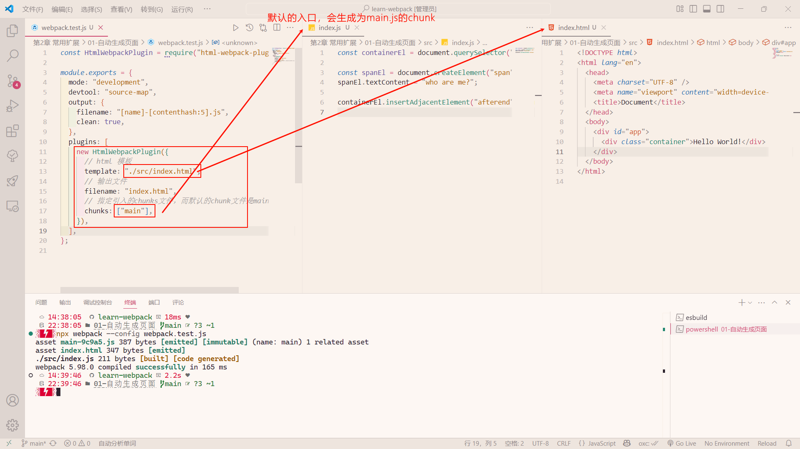
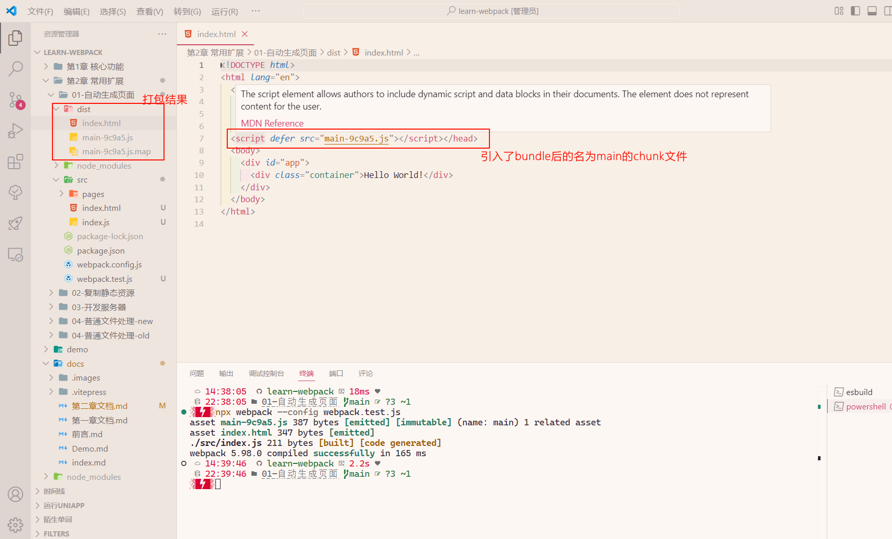
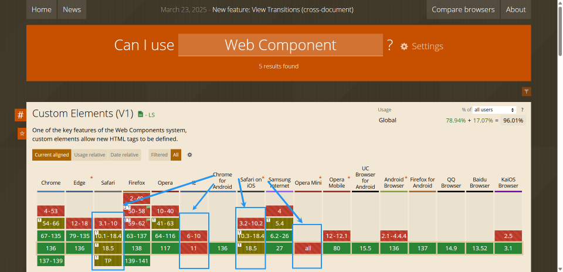
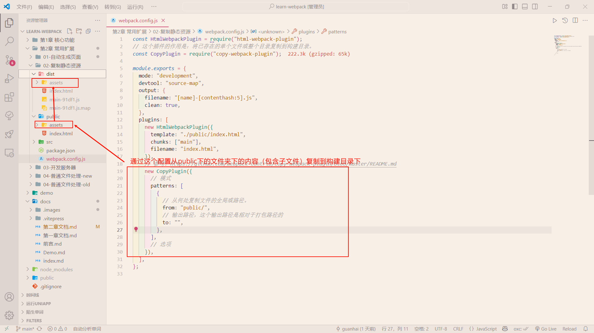
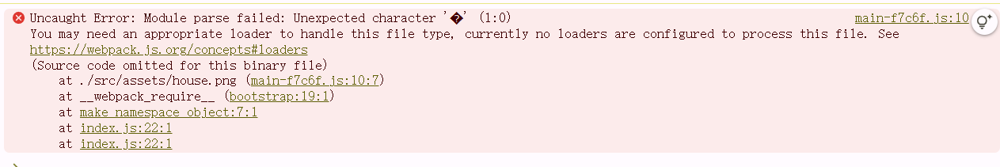
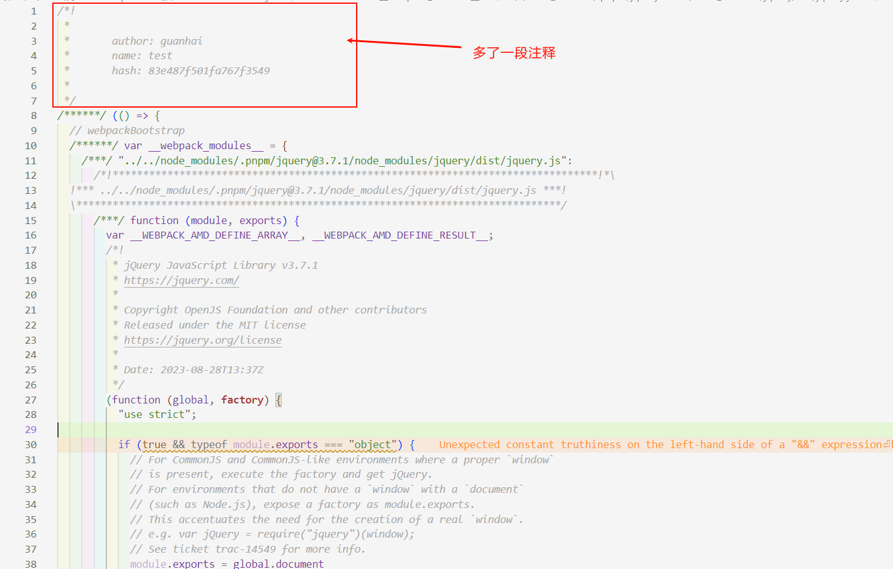
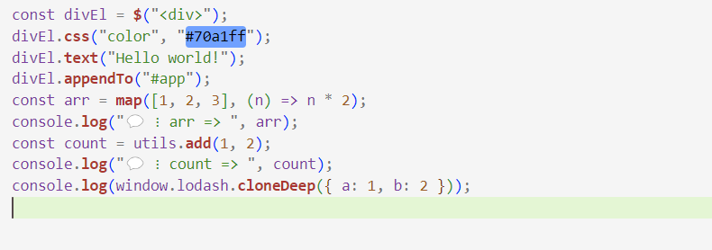
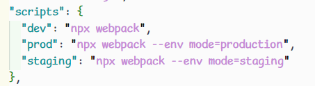
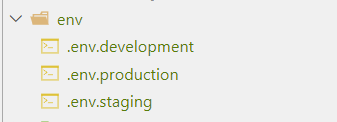
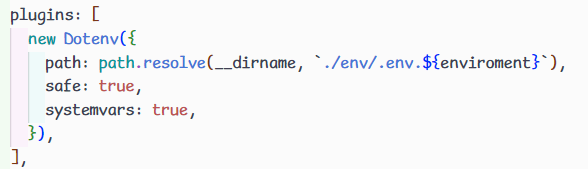

# 常用扩展

## 自动生成页面

自动生成页面的功能依靠于`webpack`的一个插件（plugin）：[`html-webpack-plugin`](https://github.com/jantimon/html-webpack-plugin)

具体作用是：将`webpack` bundle文件嵌到指定的一个HTML文件中去，并将该HTML文件输出。

安装它：

```bash
pnpm add -D html-webpack-plugin // npm install -D html-webpack-plugin
```

### 基本使用

为了方便理解，下面通过贴图来看下具体场景中的作用：

`webpack`配置文件（其中`chunks`可以配置将一个或者多个入口的`webpack` bundle文件）：



`webpack` bundle后结果：



### 多页面

上面的基础使用是使用一个HTML页面，当需要生成多个HTML页面时，需要在`webpack`的配置中创建多个该插件对象：

 

当然开发时，实际情况比这还要复杂一些，假如：上面的`home.html`和`about.html`有相同部分的HTML部分，难道都要重新写一遍吗？有没有方便，高效的办法？

其实也就是**组件化**

**方案**

1. 通过 `html-loader` + 自定义模版字符串 来完成抽取公共组件

   ::: tip 在Webpack的chunk文件中，我没有通过JavaScript的语法来导入 html，那为什么 html-loader 会生效？

   通过上面例子可以明白，html-loader的作用是将 `HtmlWebpackPlugin` 的模板解析成浏览器可以识别的 html，所以它不在常规的 Webpack 的 **入口** - **出口**的流程中，它是单独作用域 `HtmlWebpackPlugin` 这个插件

   :::

2. [Web Component](https://developer.mozilla.org/zh-CN/docs/Web/API/Web_components)

   早在2016年Google浏览器就实现这个标准，但是到目前为止（2025）还有一小部分浏览器尚未完全兼容这个标准（比如说：Safari），当然这个就跟 Webpack 没有关系了

   

3. 使用 框架

   比如说 react、vue、svelte等，这些都提供了组件化开发的方式，当然这个就跟 Webpack 关系不大，也不去做示例了

::: tip 对于第一种那为什么不用`html模版引擎`呢？

就我看到主流的 ejs 和 pug 对 webpack 的支持都有些问题（没有维护了），当然这种方案肯定有成熟的，但是目前的精力不打算放在这上面

:::

::: info 个人建议

个人建议使用第二或者第三种方案，第一种方案无论是开发复杂化、生态支持和趋势，我都不太建议

:::

::: details 代码内容

上图示例可参考该章节的`01-自动生成页面`的package.json的CLI命令

:::

## 复制静态资源

复制静态资源的功能依靠于webpack的一个插件：[`copy-webpack-plugin`](https://github.com/webpack-contrib/copy-webpack-plugin)

具体作用是：将已存在的单个文件或整个目录复制到构建目录。

场景：一些静态资源文件`JavaScript`没有使用到，但是`html`使用到了，那么这个插件就很有用；



上面这个示例中我将/public下assets文件夹（里面的图片）复制到构建目录中

:::details 代码内容

上图示例可参考该章节的`02-复制静态资源`

配置请查看示例的注释，更多信息请查看该插件的文档

:::

## 开发服务器

在**开发阶段**，目前遇到的问题是打包、运行、调试过程过于繁琐，回顾一下我们的操作流程：

1. 编写代码
2. 控制台运行命令完成打包
3. 打开页面查看效果
4. 继续编写代码，回到步骤2

并且，我们往往希望把最终生成的代码和页面部署到服务器上，来模拟真实环境

为了解决这些问题，webpack官方制作了一个单独的库：[`webpack-dev-server`](https://github.com/webpack/webpack-dev-server)

它**既不是plugin也不是loader**

### 使用

1. 安装

   ```bash
   pnpm add -D webpack-dev-server
   ```

2. 添加其webpack的配置文件的配置

   下面的`devServer`就是webpack-dev-server的配置，下面指定了服务器监听请求的端口号、指定了网页所需要的静态文件、指定要使用的 host、指定代理的URL:

   ```javascript
   const HtmlWebpackPlugin = require("html-webpack-plugin");
   const path = require("path");
   module.exports = {
     mode: "development",
     devtool: "source-map",
     output: {
       filename: "[name]-[contenthash:5].js",
       clean: true,
     },
     plugins: [
       new HtmlWebpackPlugin({
         template: "./public/index.html",
       }),
     ],
     // 参考：https://www.webpackjs.com/configuration/dev-server/ // [!code ++]
     devServer: { // [!code ++]
       port: 8000, // [!code ++]
       static: { // [!code ++]
         directory: path.resolve(__dirname, "public"), // [!code ++]
       }, // [!code ++]
       host: "local-ip", // [!code ++]
       // 参考：https://www.webpackjs.com/configuration/dev-server/#devserverproxy // [!code ++]
       proxy: [ // [!code ++]
         { // [!code ++]
           context: ["/api"], // [!code ++]
           target: "https://api.vvhan.com", // [!code ++]
           changeOrigin: true, // [!code ++]
         }, // [!code ++]
       ], // [!code ++]
     }, // [!code ++]
     stats: "minimal",
   };
   ```

3. 执行```webpack-dev-server```命令

   ```bash
   npx webpack-dev-server // 方式一：使用其API
   npx webpack serve // 方式二：使用CLI
   ```

```webpack-dev-server```命令几乎支持所有的webpack命令参数，如```--config```、```-env```等等，你可以把它当作webpack命令使用

这个命令是专门为开发阶段服务的，真正部署的时候还是得使用webpack命令

### 机制

当我们执行```webpack-dev-server```命令后，它做了以下操作：

1. 内部执行webpack命令，传递命令参数
2. 开启watch
3. 注册hooks：类似于plugin，webpack-dev-server会向webpack中注册一些钩子函数，主要功能如下：
   1. 将资源列表（aseets）保存起来
   2. 禁止webpack输出文件
4. 用express开启一个服务器，监听某个端口，当请求到达后，根据请求的路径，给予相应的资源内容

:::details 代码内容

上述示例的webpack配置文件来源于`03-开发服务器`。

在该仓库中可以思考下为什么要用`html-webpack-plugin`呢？或许可以通过bundle来试一下（npx webpack）

:::

## 普通文件处理

在webpack5之前，处理普通文件（如图片、字体、视频等非 JavaScript/CSS 文件）主要依赖 **第三方 Loader**（如 `file-loader`、`url-loader` 等）。

比如一个场景：在js中导入一张图片，通过dom创建一个img元素，将引用指向这种图片，之后将img元素插入到HTML中。

```javascript
// 示例
import housePng from "./assets/house.png" // 假设这个图片存在
const appEl = document.querySelector("#app")
const houseImgEl = document.createElement("img")
houseImgEl.src = housePng
appEl.append(houseImgEl)
```

如果直接这样做，webpack对此进行处理将会是失败的：



因为在JavaScript中导入的图片是一个二进制的字符串，而webpack默认是无法正确解析这个字符串的。

根据之前学习的知识，碰到这个问题可以使用第三方的loader来解决，但根据webpack版本不同有两种解决方式：

* 通过第三方 loader 来解析文件内容（webpack5之前主要的处理方式）
* 通过 webpack5 的 [资源模块](https://www.webpackjs.com/guides/asset-modules/) 来处理文件内容

### 第三方loader处理

借助`file-loader`、`url-loader`、`raw-loader`等第三方loader来处理文件内容。

**`file-loader`** :通过该loader将文件复制到输出目录，并返回文件的最终访问路径（public URL）在JavaScript中。

**`url-loader`**: 通过该loader将文件内容对应的二进制字符串转化为 [Base64 Data URL](https://developer.mozilla.org/zh-CN/docs/Glossary/Base64) 内联到JavaScript中。

**`raw-loader`**: 通过该loader将直接获取文件的原始内容，而不是经过处理的资源 URL 或模块

:::details 代码内容

这部分具体使用请查看`04-普通文件处理-old`

:::

### 资源模块

通过webpack5中[资源模块](https://www.webpackjs.com/guides/asset-modules/)来转化，也是之后内容主要采用的方式

**资源模块类型`asset/resource`** ：发送一个单独的文件，并返回文件访问路径URL。（之前通过`file-loader`实现）

**资源模块类型`asset/inline`**：将文件内容转化为 [Base64 Data URL](https://developer.mozilla.org/zh-CN/docs/Glossary/Base64) 内联到代码中。（之前通过`url-loader`实现）

**资源模块类型`asset/source`**：导出资源模块的源代码。（之前通过使用 `raw-loader` 实现）

**资源模块类型`asset`**: 在导出一个 data URI 和发送一个单独的文件之间自动选择。之前通过使用 `url-loader`，并且配置资源体积限制实现

:::details 代码内容

这部分具体使用请查看`04-普通文件处理-new`和官方文档：[资源模块](https://www.webpackjs.com/guides/asset-modules/)

:::

## 内置插件

webpack除了第三方插件外，内部也有一些内置插件，需要手动引入webpack的api就可使用

常用的有三个：`DefinePlugin`、`BannerPlugin`、`ProvidePlugin`

* **`DefinePlugin`**

  定义全局变量，值只能是字符串，这个字符串在JavaScript中可能是变量，也可能只是一个普通字符串

  ```JavaScript
  const webpack = require("webpack");
  module.exports = {
    // ...
    plugins: [
      // 定义全局变量，值只能是字符串
      new webpack.DefinePlugin({
        PI: `Math.PI`, // const PI = Math.PI
        VERSION: `"1.0.0"`, // const VERSION = "1.0.0"
        DOMAIN: JSON.stringify("duyi.com"), // const DOMAIN = "douyi.com"
      }),
    ],
  };
  ```

  在webpack的入口文件中，可以直接使用`PI`、`VERSION`、`DOMAIN`变量

* **`BannerPlugin`**

  为每个chunk文件的头部添加一行注释，比如说：添加作者、公司、版权等信息

  ```javascript
  const webpack = require("webpack");
  
  module.exports = {
    // ...  
    plugins: [
      // 为每个chunk文件的头部添加一行注释，一般用来添加作者、公司、版权等信息
      new webpack.BannerPlugin({
        banner: `
        author: guanhai
        name: test
        hash: [hash]
        `,
      }),
    ],
  };
  ```

  通过webpack编译后可以看到编译后的JavaScript文件头部多了一段注释：

  

* **`ProvidePlugin`**

  自动加载模块，而不必在任何地方`import`或者`require`它们。

  ```JavaScript
  const path = require("path");
  const webpack = require("webpack");
  
  module.exports = {
    plugins: [
      // 自动加载模块，而不必到处import或者require
      new webpack.ProvidePlugin({
        utils: path.resolve(__dirname, "src/utils/index.js"), // 引入本地文件在入口文件中自动加载模块
        $: "jquery", // 引入第三方库jquery在入口文件中自动加载模块
        map: ["lodash-es", "map"], // 引入第三方库lodash-es的map api在入口文件中自动加载模块
        "window.lodash": "lodash-es", // 在浏览器的window上挂载lodash属性为lodash-es第三方库，在入口文件中自动加载模块
      })
    ],
  };
  ```

  使用方式有多种，在上面示例中可以看到，包含：

  1. 加载本地文件作为模块
  2. 加载第三方库作为模块
  3. 加载第三方库的某个api作为模块
  4. 为全局变量的某个api自动加载模块

  在入口的JavaScript文件，可以直接使用这些自动加载的模块：

  

:::details 代码内容

内置模块的具体使用，请看`05-webpack内置插件`

:::

## 区分环境的变量

在第一章中我们可以通过区分环境以获取不同webpack的构建项，但在实际的大型工程中会碰到不同环境下有全局变量不尽相同。

比如说：

客户端：开发环境下有代理服务的基准地址，但是在测试环境和生产环境是一个部署的地址；不同模式下打包路径等等；如果使用Vue，在使用Vue-router时，可能也需要一个路由模式的变量

服务端：不同环境下数据库的地址、用户名、密码等

我们可以通过[dotenv-webpack](https://github.com/mrsteele/dotenv-webpack)这个插件来完成上面的需求，它可以通过指定一个文件（默认是`.env`）来声明全局变量，不同环境下读取不同的全局声明变量文件：

1. 首先通过`package.json`中脚本来对不同环境生成一个个脚本

   

2. 声明不同环境下的全局配置文件，如：`.env.devlopment`, `.env.production`, `.env.staging`

   

3. 配置`dotenv-webpack`插件，下图其中`enviroment`为环境配置的`mode`

   

默认情况下，可以通过 `process.env` 来访问该插件声明的环境配置文件（即`.env.devlopment`等文件）的变量，如：`process.env.WEBPACK_ENV_NAME`。如果说下换一种**前缀**来访问该插件声明的环境配置文件的变量的话，可以配置其`prefix`。

比如说`vite`构建工具访问环境变量是通过`import.meta.env.xxx`来访问环境变量的，那么在使用该插件要达成相同的效果，配置`prefix`为`import.meta.env.`即可

::: details 代码内容

详细的代码内容，请看：`06-区分环境的变量`

:::
