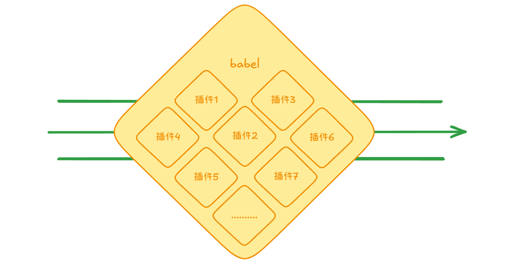
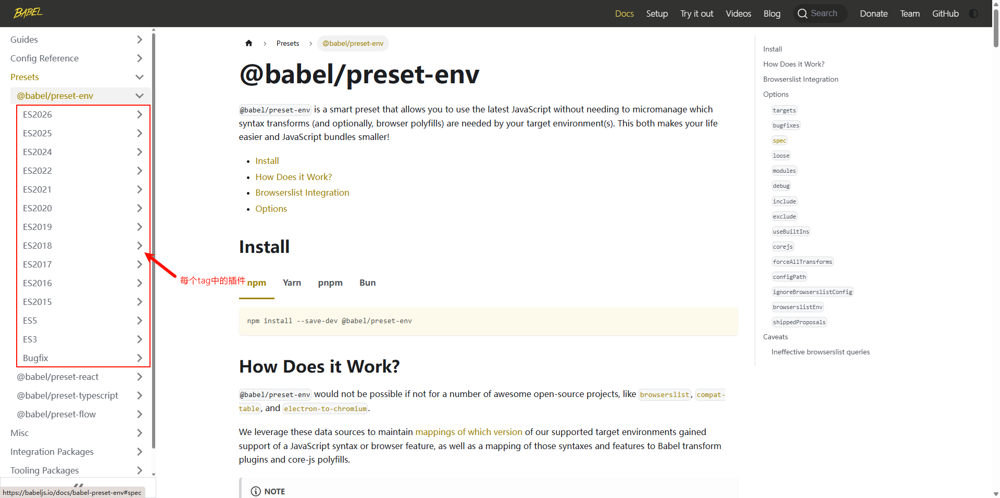
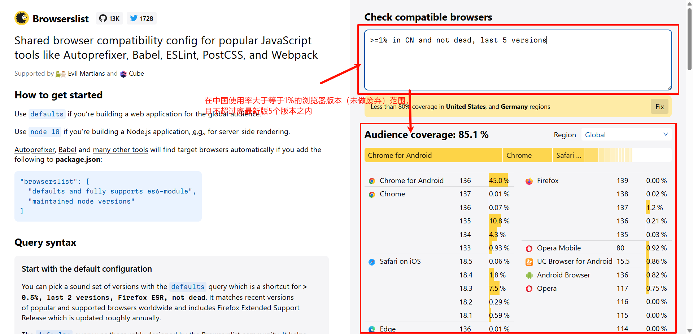
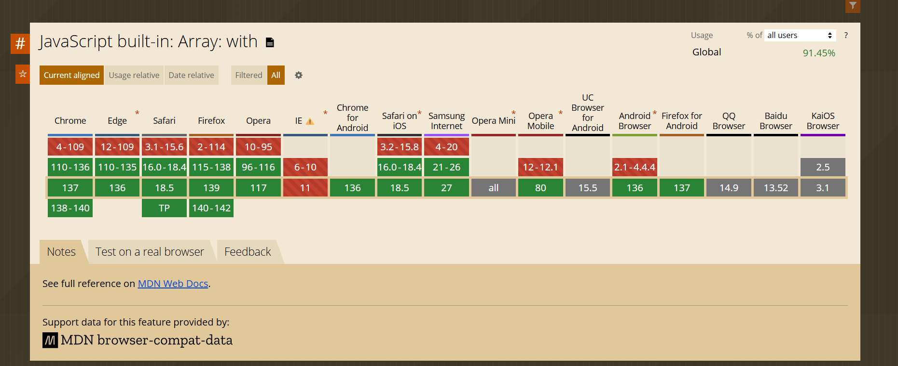
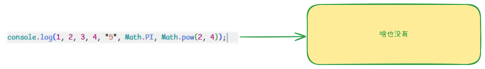
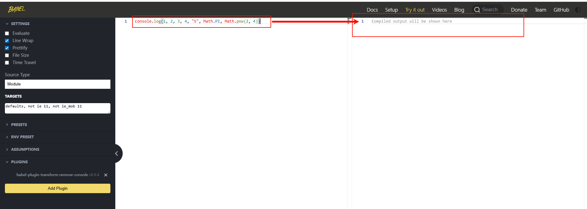
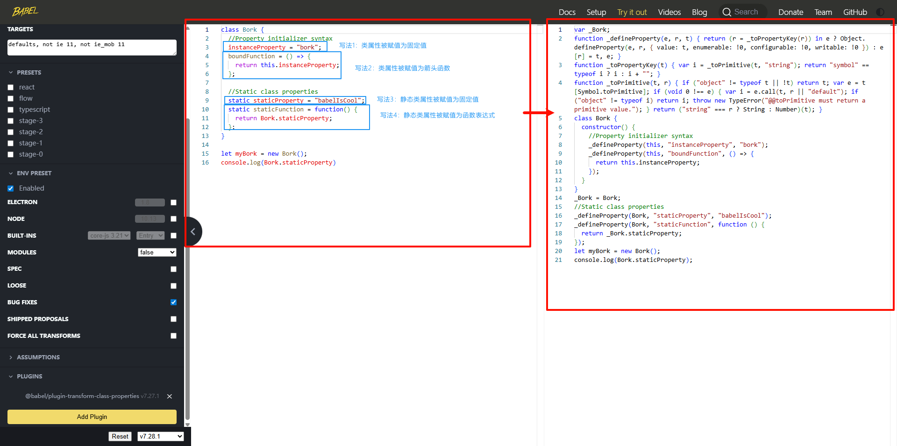
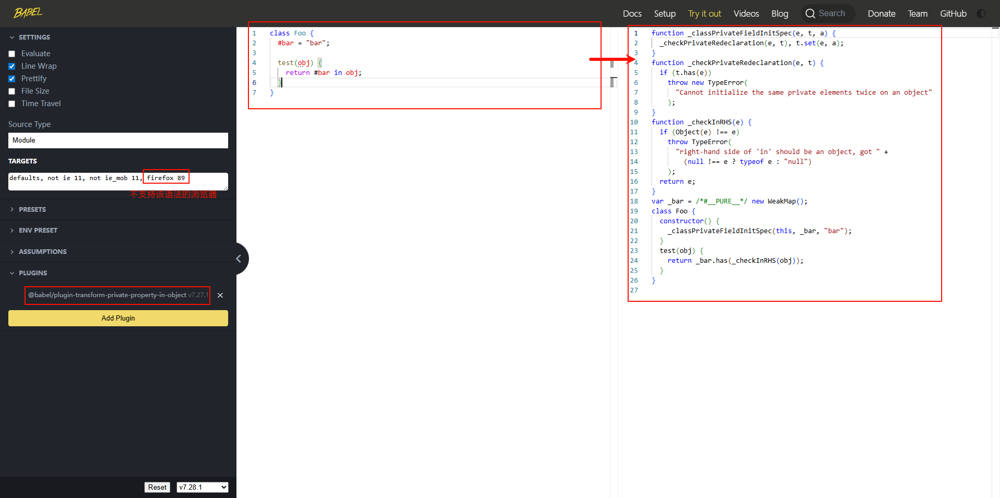

# JavaScript 兼容性

## 来源

JavaScript 兼容性问题的根本原因在于各大浏览器厂商在实现 JavaScript 时的差异。为了解决这种混乱，ECMA 国际组织于 1997 年制定了 ECMAScript（ECMA-262）标准，由 [TC39 委员会](https://github.com/tc39/ecma262) 负责维护和推进。ECMAScript 规范定义了 JavaScript 的语法、类型、语句、关键字、操作符和内置对象等内容，推动了 JavaScript 语言的标准化和持续发展。

虽然 ECMAScript 标准每年持续更新，引入新特性和改进，但由于各浏览器对新标准的支持进度不同，兼容性问题依然存在。开发者通常需要借助如 [Can I use](https://caniuse.com/) 等工具查询各浏览器对语法和 API 的支持情况，并通过 Babel 等工具进行语法降级和 polyfill 处理，以实现跨浏览器兼容。

从中可以看出，JavaScript 兼容性问题主要在于浏览器环境对 JavaScript 的支持，包括但不限于：新语法、API 的实现（ECMAScript 标准、DOM/BOM 等）。可以参考 [Can I use](https://caniuse.com/) 来查询主流浏览器对 API 的支持情况。

## 解决

使用最多、共识的是编译器[babel](https://babeljs.io/)，但现代前端开发的新兴工具还有：[swc](https://github.com/swc-project/swc)、[oxc](https://github.com/oxc-project/oxc)

它们的作用：将 JavaScript 的语法降级，缺失 API 模拟（core-js 实现），甚至可以通过一些插件处理 CSS 的兼容性（JavaScript 去操作 CSS，做样式降级或者自动补全 `-webkit-` 前缀等）、将 JavaScript 中新的提案语法降级成标准化语法等。这样就解决了 JavaScript 的兼容性问题

下面会详细介绍下 babel

babel 的语意也叫做“巴别塔”，来源于希伯来语，巴别塔象征的统一的国度、统一的语言。


而 JavaScript 的世界缺少一座巴别塔，不同版本的浏览器能识别的 ES 标准并不相同，就导致了开发者面对不同版本的浏览器要使用不同的语言，和古巴比伦一样，前端开发也面临着这样的困境。

它的出现就是用于解决这样的问题，它是一个编译器，可以把不同标准书写的语言，编译为统一的、能被各种浏览器识别的语言。


babel 的转化方式灵活多样，与构建工具、postcss 有些类似，转化需要依靠插件实现，本身提供语法分析的功能。



## Babel

官网：[babel](https://babeljs.io/)，中文网：[babel 中文网](https://babel.nodejs.cn/)

babel测试工具：[babel训练场](https://babeljs.io/repl)

### 使用

单独使用 babel，需要使用到`@babel/cli`和`@babel/core`这两个库。

`@babel/cli`：babel 核心库，提供了编译所需的所有 api

`@babel/core`：提供一个命令行工具，调用核心库的 api 完成编译

1. 安装：

   ```shell
   pnpm add -D @babel/core @babel/cli
   ```

2. 使用`@babel/cli`编译：

   ```shell
   # 按文件编译，--out-file 可以缩写为 -o，
   npx babel target.js --out-file output.js

   # 案目录编译, --out-dir 可以缩写为 -d
   npx babel src --out-dir lib
   ```

   其中还可以指定参数：

   - --watch（可以缩写为-w）可以在每次更改文件时编译文件

   - --source-maps（可以缩写为-s）来添加映射文件

   更多命令行参数参考：[docs babel-cli](https://babel.nodejs.cn/docs/babel-cli)

3. 使用 babel 插件

   一般情况下，我们使用 babel 的大部分功能是基于插件的，要启用这个功能需要

   - 使用 babel 的配置文件（babel 编译的入口）

     可以是`babel.config.json`、`.babel.json`、`.babelrc`，甚至可以在`package.json`中配置选项

     配置文件内容结构类似于：

     ```json
     {
     	"presets": [...],
         "plugins": [...]
     }
     ```

   - 根据经验、文档、插件仓库（自己手写也行）选择插件或者预设

     大部分情况下都会使用的到：@babel/preset-env 这个预设

     如果说你用框架是 react，使用 babel 时会用到 @babel/preset-react , 这个主要针对于 react ，比如它的 jsx 文件

     还有 TypeScript，使用 babel 时会用到 @babel/preset-typescript。

     插件仓库主要是一些语法转换插件（解析新的或者实验性 JavaScript 语法转换成向后兼容的 JavaScript 语法）、模块格式转化插件、预设插件等，地址：[插件列表](https://babel.nodejs.cn/docs/plugins-list)

     ::: tip 什么是预设呢？

     预设是多个插件的集合，配置预设可以节省必要插件的安装和配置项

     :::

   - 启用 babel 实时编译（自定义命令行参数）

     ```shell
     # 示例
     npx babel src -d dist -w
     ```

### babel预设

babel预设是一组插件的集合。

babel 配置文件中的`preset`就是配置**预设**的地方，需要注意的是 babel 预设的加载是有**顺序**的，是**从后往前**的，如果配置的预设有使用到同一个插件，那么最新的会覆盖旧的。

这里详细讲一下 babel 的 `@babel/preset-env` 预设，也是最常用的预设。下面是该预设包含的插件（截至2025年babel官网）:



作用：使用最新的 JavaScript，而无需微观管理目标环境需要哪些**语法转换**和**API 转换**。这既让你的生活更轻松，也让 JavaScript 包更小！

| **转换类型** | **处理对象**            | **配置工具**                   | **示例**                        |
| :----------- | :---------------------- | :----------------------------- | :------------------------------ |
| **语法转换** | 新语法（ES6+ 语法特性） | `@babel/preset-env` + 语法插件 | 箭头函数、类、解构、可选链 `?.` |
| **API 转换** | 新 API（内置对象/方法） | `core-js` + `useBuiltIns` 配置 | `Promise`、`Array.includes()`   |

在这一节的配置项就涉及到了**API 转换**，至于**语法转换**在下一节[babel 插件](/knowledge/第四章文档.html#babel插件)中涉及

:::tip 预设`@babel/preset-env `会用上所有插件吗🧐

实际上不会，该预设会根据所包含的浏览器，自动选用插件集合，这个策略取决插件转换的语法在包含的浏览器中是否有必要。很显然，这个策略会非常合理，毕竟如果一种JavaScript语法能够在所包含的浏览器上运行，其转换这个语法的插件也没有必要使用。

> 这里提到的"预设会根据所包含的浏览器"，后面可以根据该预设的配置项配置。

:::

安装：

```shell
pnpm add -D @babel/preset-env
```

配置项：

```json
{
  "preset": [
    [
      "@babel/preset-env",
      {
        // 配置项 假设下面配置存在
        "a": "a1" // [!code ++]
      }
    ]
  ]
}
```

@babel/preset-env 预设也对[browserslist](https://github.com/browserslist/browserslist)进行了集成，可以通过选项 targets 来配置（需要将`ignoreBrowserslistConfig`置为 true），如:

```json
{
  "preset": [
    [
      "@babel/preset-env",
      {
        "ignoreBrowserslistConfig": true, // [!code ++]
        "targets": {
          // [!code ++]
          "chrome": "58", // [!code ++]
          "ie": "11" // [!code ++]
        } // [!code ++]
      }
    ]
  ]
}
```

但通常情况下，会使用[browserslist](https://github.com/browserslist/browserslist)指定的配置文件，往往是`.browserslistrc`文件，因为工程化生态系统中，像 postcss、stylelint 等一些工具也会使用到它，如：

```
last 10 version
> 1%
not ie <= 8
```

::: details 那 browserslist 是什么？

它的作用是通过其配置文件去涵盖你想要**兼容的浏览器范围**，它的语法使用需要参考：[Browserslist](https://browsersl.ist/)，下面使用一个示例（语法使用在左侧有文档）：



:::

那么接下来讲一下这个预设常用的几个配置项：

1. usebuiltins

   用于如何处理 polyfill，默认为 false，也就是禁用 polyfill。使用"usage"或者"entry"才会引入 core-js 作为 polyfill，而"usage"和"entry"的区别在于："usage"是按需引入（仅添加代码中实际用到的 API 的 polyfill），"entry"是全量引入（根据目标浏览器，一次性引入所有可能缺失的提案 polyfill）

2. core-js

   一般情况下传递一个对象，如果是字符串代表版本，如：`"core-js": "3.41"`

   version: 指定`core-js`的版本

   shippedProposals: 是否启用浏览器中发布了一段时间的提案 polyfill 和转换

3. modules

   这个配置将启用将 ES 模块语法转换为另一种模块类型，将此设置为 `false` 将保留 ES 模块。仅当你打算将原生 ES 模块发送到浏览器时才使用此选项。如果你使用 Babel 的 bundler，默认的 `modules: "auto"` 总是首选。

   这个配置可以是 "amd" | "umd" | "systemjs" | "commonjs" | "cjs" | "auto" | false

4. ignoreBrowserslistConfig

   用于指示 Babel 是否忽略项目中的 Browserslist 配置文件，默认为 false

   如果启用（true）时，通常和 target 搭配

5. includes 和 exclude

   includes 选项指定一个字符串数组，每一个字符串元素也就是babel插件的名称，强制使用每个babel插件，可选用的有效字符串：[babel插件](https://github.com/babel/babel/blob/main/packages/babel-preset-env/src/available-plugins.ts) 和 内置插件（[核心 js@3](https://github.com/babel/babel/blob/master/packages/babel-preset-env/src/polyfills/corejs3/built-in-definitions.js) 和 [核心 js@2](https://github.com/babel/babel/blob/master/packages/babel-preset-env/src/polyfills/corejs2/built-in-definitions.js)）

   exclude 选项指定一个始终排除/删除的插件数组。可能的选项与上面的include选项相同

::: details 什么是 polyfill（垫片）?

它是指一段 JavaScript 代码，它用于在现代浏览器中“模拟”或“填充”哪些旧版本浏览器原生不支持的 JavaScript API、HTML 5 功能或者 CSS 特性

polyfill（垫片）的目的是：让开发者能够使用最新的 Web 标准特性进行开发，同时确保这些特性在老旧或不支持它们的浏览器中也能基本正常运行，从而提升跨浏览器的兼容性。

比如从 [Can I use](https://caniuse.com/) 查找 Array.prototype.with API（ES2023 新出的）：



发现我们需要兼容 IE 和 一些不知道是否实现的其他浏览器（如 UC Browser for Android 等），我通过 babel 引入 polyfill，查看编译后结果：



但是在使用 babel 的 polyfill 需要注意一点，就是图片上`core-js`做 polyfill 的库，它是对 **ECMAScript 标准 API**做垫片处理，不对 Web API 做垫片处理（比如：浏览器环境的 fetch）

:::

其他的预设感兴趣可以自己去探索：[babel presets](https://babel.nodejs.cn/docs/presets)

这里还推荐一个预设[babel-minify](https://github.com/babel/minify)可以减少构建后的 JavaScript 体积

### babel插件

babel 配置文件中的`plugins`就是配置**插件**的地方，同样插件的加载也是有顺序的，是**从前往后**（与`babel预设`相反），且**插件是在预设之前运行**。

插件的选项配置和预设类似：

```json
{
  // ...
  "plugins": [
    [
      // 插件名 // [!code ++]
      "xxx", // [!code ++]
      {
        // [!code ++]
        // 插件选项 // [!code ++]
        "option1": "val1", // [!code ++]
        "option2": "val2" // [!code ++]
      } // [!code ++]
    ]
  ]
}
```

下面是一些有意思的插件：

1. `babel-plugin-transform-remove-console`

   该插件会移除源码中的打印的日志

   

   配置项：

   `exclude`：排除的 console api 方式

   如：

   ```json
   {
     "plugins": [
       // console.error 和 console.warn 不会被插件移除
       [
         "babel-plugin-transform-remove-console", // [!code focus]
         { "exclude": ["error", "warn"] }, // [!code focus]
       ]
     ]
   }
   ```

2. `@babel/plugin-transform-json-modules`

   这个插件可以将ES2025的新特性，作用是将 `import ... with { type: "json" }` 声明转换为特定于平台的 API 以读取然后 `JSON.parse` 导入的文件。

   在示例中[babel训练场](https://babeljs.io/repl)会将这种语法转换成**Browsers**和**node.js**都兼容的模式：

   

   使用：

   ```json
   {
       "plugins": [
           ["@babel/plugin-transform-json-modules"], // [!code focus]
       ]
   }
   ```

   如果需要转换成其他的CommonJS等语法规范，可以设置 `@babel/preset-env` 预设的`modules`选项。

3. `@babel/plugin-transform-class-properties`

   这个插件是ES2022的新特性，可以转换四种类属性的写法，降级为兼容的语法：

   * 类属性被赋值为固定值
   * 类属性被赋值为箭头函数
   * 静态类属性被赋值为固定值
   * 静态类属性被赋值为函数表达式

   可以在[babel训练场](https://babeljs.io/repl)看到这四种写法和经过该插件编译后的结果：

   

   结合@babel/preset-env使用：

   ```json
   {
       "preset-env": [
       [
         "@babel/preset-env",
         {
           // 省略其他。。。。。
           "include": [
             // 全称为 "@babel/plugin-transform-class-properties"，下面是简写 // [!code focus]
             "transform-class-properties", // [!code focus]
           ]
         }
       ]
     ]
   }
   ```

4. `@babel/plugin-transform-private-property-in-object`

   这个插件是ES2022的新特性，可以转换类中的[私有元素](https://developer.mozilla.org/zh-CN/docs/Web/JavaScript/Reference/Classes/Private_elements)，降级为兼容的语法。

   > 当今环境大部分浏览器都支持了私有元素，所以在babel训练场编译的时候，需要加入该语法不兼容的浏览器才能转换为兼容的语法。

   在[babel训练场](https://babeljs.io/repl)可以看到私有属性经过该插件编译后的结果：

   

   ```json
   {
       "preset-env": [
       [
         "@babel/preset-env",
         {
           // 省略其他。。。。。
           "include": [
             // 全称为 "@babel/plugin-transform-private-property-in-object"，下面是简写 // [!code focus]
             "transform-private-property-in-object", // [!code focus]
           ]
         }
       ]
     ]
   }
   ```

::: info 代码示例

请参考`/concept/Babel`子仓库

:::
