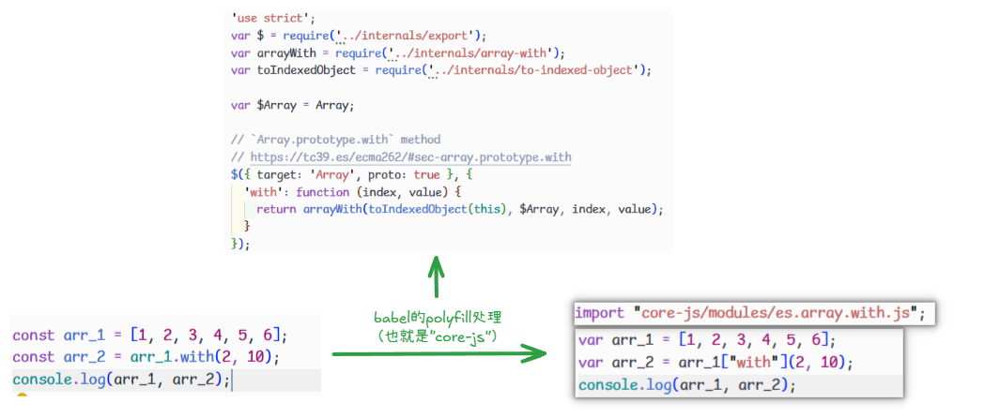

# JavaScript 兼容性

**1995 年**: JavaScript 由 Brendan Eich 在网景公司（Netscape）发明，最初被称为 Mocha，后来改名为 LiveScript，最终定名为 JavaScript。这种命名是为了利用当时 Java 语言的流行。

**1996 年**: Netscape Navigator 2.0 中首次包含了 JavaScript。微软很快注意到 JavaScript 的潜力，并在其 Internet Explorer 3.0 中推出了 JScript，这是 JavaScript 的一个变体。

**1997 年**: ECMA 国际组织制定了 JavaScript 的标准，并发布了 ECMAScript 1.0（简称 ES1），JavaScript 成为一种标准化的脚本语言。

**1999 年**: ECMAScript 3（ES3）发布，这是一个重要的版本，引入了正则表达式、try/catch 异常处理等。

**2000 年代初**: 随着浏览器战争（Browser Wars）的进行，不同浏览器对 JavaScript 的支持出现了分歧，导致了“跨浏览器兼容性”的问题。

**2005 年**: Jesse James Garrett 提出了 Ajax（Asynchronous JavaScript and XML）概念，这一技术使得网页可以在不重新加载页面的情况下与服务器通信，极大推动了 Web 应用的发展。

**2009 年**: ECMAScript 5（ES5）发布，这是继 ES3 之后的一个重要版本，引入了严格模式（Strict Mode）、JSON 支持、新的数组方法等。

**2009 年**: Node.js 诞生，由 Ryan Dahl 开发，允许 JavaScript 在服务器端运行，推动了 JavaScript 全栈开发的潮流。

**2010 年左右**: 各种 JavaScript 框架如 AngularJS、React、Vue.js 开始兴起，推动了前端开发的变革。

**2015 年**: ECMAScript 6（ES6，也称 ES2015）发布，这是 JavaScript 发展史上的一个重大里程碑。ES6 引入了许多重要的新特性，如块级作用域、箭头函数、类、模板字符串、模块化等，使 JavaScript 成为一种更加现代化和强大的编程语言。

**2016 年-至今**: ECMAScript 标准开始逐年更新，发布了 ES2016、ES2017 等，每年引入一些新特性和改进。

从中可以看出 JavaScript 兼容性问题主要在于浏览器环境的 JavaScript 的支持，包括不限于：JavaScript 的新语法、浏览器对 JavaScript 的 API 的实现（ECMAScript 标准、DOM/BOM）等

可以参考 [Can I use](https://caniuse.com/) 来查询（市面主要）浏览器对 API 的支持

## 解决

使用最多、共识的是编译器[babel](https://babeljs.io/)，但现代前端开发的新兴工具还有：[swc](https://github.com/swc-project/swc)、[oxc](https://github.com/oxc-project/oxc)

它们的作用：将 JavaScript 的语法降级，缺失 API 模拟（core-js 实现），甚至可以通过一些插件处理 CSS 的兼容性（JavaScript 去操作 CSS，做样式降级或者自动补全 `-webkit-` 前缀等）、将 JavaScript 中新的提案语法降级成标准化语法等。这样就解决了 JavaScript 的兼容性问题

下面会详细介绍下 babel

babel 的语意也叫做“巴别塔”，来源于希伯来语，巴别塔象征的统一的国度、统一的语言。


而 JavaScript 的世界缺少一座巴别塔，不同版本的浏览器能识别的 ES 标准并不相同，就导致了开发者面对不同版本的浏览器要使用不同的语言，和古巴比伦一样，前端开发也面临着这样的困境。

它的出现就是用于解决这样的问题，它是一个编译器，可以把不同标准书写的语言，编译为统一的、能被各种浏览器识别的语言。


babel 的转化方式灵活多样，与构建工具、postcss 有些类似，转化需要依靠插件实现，本身提供语法分析的功能。


## Babel

官网：[babel](https://babeljs.io/)，中文网：[babel 中文网](https://babel.nodejs.cn/)

babel playground：https://babeljs.io/repl

### 使用

单独使用 babel，需要使用到`@babel/cli`和`@babel/core`这两个库。

`@babel/cli`：babel 核心库，提供了编译所需的所有 api

`@babel/core`：提供一个命令行工具，调用核心库的 api 完成编译

1. 安装：

   ```shell
   pnpm add -D @babel/core @babel/cli
   ```

2. 使用`@babel/cli`编译：

   ```shell
   # 按文件编译，--out-file 可以缩写为 -o，
   npx babel target.js --out-file output.js

   # 案目录编译, --out-dir 可以缩写为 -d
   npx babel src --out-dir lib
   ```

   其中还可以指定参数：

   - --watch（可以缩写为-w）可以在每次更改文件时编译文件

   - --source-maps（可以缩写为-s）来添加映射文件

   更多命令行参数参考：[docs babel-cli](https://babel.nodejs.cn/docs/babel-cli)

3. 使用 babel 插件

   一般情况下，我们使用 babel 的大部分功能是基于插件的，要启用这个功能需要

   - 使用 babel 的配置文件（babel 编译的入口）

     可以是`babel.config.json`、`.babel.json`、`.babelrc`，甚至可以在`package.json`中配置选项

     配置文件内容结构类似于：

     ```json
     {
     	"presets": [...],
         "plugins": [...]
     }
     ```

   - 根据经验、文档、插件仓库（自己手写也行）选择插件或者预设

     大部分情况下都会使用的到：@babel/preset-env 这个预设

     如果说你用框架是 react，使用 babel 时会用到 @babel/preset-react , 这个主要针对于 react ，比如它的 jsx 文件

     还有 TypeScript，使用 babel 时会用到 @babel/preset-typescript。

     插件仓库主要是一些语法转换插件（解析新的或者实验性 JavaScript 语法转换成向后兼容的 JavaScript 语法）、模块格式转化插件、预设插件等，地址：[插件列表](https://babel.nodejs.cn/docs/plugins-list)

     ::: tip 什么是预设呢？

     预设是多个插件的集合，配置预设可以节省必要插件的安装和配置项

     :::

   - 启用 babel 实时编译（自定义命令行参数）

     ```shell
     # 示例
     npx babel src -d dist -w
     ```

### babel 预设

babel 配置文件中的`preset`就是配置**预设**的地方，需要注意的是 babel 预设的加载是有**顺序**的，是**从后往前**的，如果配置的预设有使用到同一个插件，那么最新的会覆盖旧的。

这里详细讲一下 babel 的 `@babel/preset-env` 预设，也是最常用的预设。

作用：使用最新的 JavaScript，而无需微观管理目标环境需要哪些**语法转换**和**API 转换**。这既让你的生活更轻松，也让 JavaScript 包更小！

| **转换类型** | **处理对象**            | **配置工具**                   | **示例**                        |
| :----------- | :---------------------- | :----------------------------- | :------------------------------ |
| **语法转换** | 新语法（ES6+ 语法特性） | `@babel/preset-env` + 语法插件 | 箭头函数、类、解构、可选链 `?.` |
| **API 转换** | 新 API（内置对象/方法） | `core-js` + `useBuiltIns` 配置 | `Promise`、`Array.includes()`   |

在这一节的配置项就涉及到了**API 转换**，至于**语法转换**在下一节[babel 插件](/knowledge/第四章文档.html#babel插件)中涉及

安装：

```shell
pnpm add -D @babel/preset-env
```

配置项：

```json
{
  "preset": [
    [
      "@babel/preset-env",
      {
        // 配置项 假设下面配置存在
        "a": "a1" // [!code ++]
      }
    ]
  ]
}
```

@babel/preset-env 预设也对[browserslist](https://github.com/browserslist/browserslist)进行了集成，可以通过选项 targets 来配置（需要将`ignoreBrowserslistConfig`置为 true），如:

```json
{
  "preset": [
    [
      "@babel/preset-env",
      {
        "ignoreBrowserslistConfig": true, // [!code ++]
        "targets": {
          // [!code ++]
          "chrome": "58", // [!code ++]
          "ie": "11" // [!code ++]
        } // [!code ++]
      }
    ]
  ]
}
```

但通常情况下，会使用[browserslist](https://github.com/browserslist/browserslist)指定的配置文件，往往是`.browserslistrc`文件，因为工程化生态系统中，像 postcss、stylelint 等一些工具也会使用到它，如：

```
last 10 version
> 1%
not ie <= 8
```

::: details 那 browserslist 是什么？

它的作用是通过其配置文件去涵盖你想要**兼容的浏览器范围**，它的语法使用需要参考：[Browserslist](https://browsersl.ist/)，下面使用一个示例（语法使用在左侧有文档）：


:::

那么接下来讲一下这个预设常用的几个配置项：

1. usebuiltins

   用于如何处理 polyfill，默认为 false，也就是禁用 polyfill。使用"usage"或者"entry"才会引入 core-js 作为 polyfill，而"usage"和"entry"的区别在于："usage"是按需引入（仅添加代码中实际用到的 API 的 polyfill），"entry"是全量引入（根据目标浏览器，一次性引入所有可能缺失的 polyfil）

2. core-js

   一般情况下传递一个对象，如果是字符串代表版本，如：`"core-js": "3.41"`

   version: 指定`core-js`的版本

   shippedProposals: 是否启用浏览器中发布了一段时间的提案 polyfill 和转换

3. modules

   这个配置将启用将 ES 模块语法转换为另一种模块类型，将此设置为 `false` 将保留 ES 模块。仅当你打算将原生 ES 模块发送到浏览器时才使用此选项。如果你使用 Babel 的 bundler，默认的 `modules: "auto"` 总是首选。

   这个配置可以是 "amd" | "umd" | "systemjs" | "commonjs" | "cjs" | "auto" | false

4. ignoreBrowserslistConfig

   用于指示 Babel 是否忽略项目中的 Browserslist 配置文件，默认为 false

   如果启用（true）时，通常和 target 搭配

::: details 什么是 polyfill（垫片）?

它是指一段 JavaScript 代码，它用于在现代浏览器中“模拟”或“填充”哪些旧版本浏览器原生不支持的 JavaScript API、HTML 5 功能或者 CSS 特性

polyfill（垫片）的目的是：让开发者能够使用最新的 Web 标准特性进行开发，同时确保这些特性在老旧或不支持它们的浏览器中也能基本正常运行，从而提升跨浏览器的兼容性。

比如从 [Can I use](https://caniuse.com/) 查找 Array.prototype.with API（ES2023 新出的）：


发现我们需要兼容 IE 和 一些不知道是否实现的其他浏览器（如 UC Browser for Android 等），我通过 babel 引入 polyfill，查看编译后结果：


但是在使用 babel 的 polyfill 需要注意一点，就是图片上`core-js`做 polyfill 的库，它是对 **ECMAScript 标准 API**做垫片处理，不对 Web API 做垫片处理（比如：浏览器环境的 fetch）

:::

其他的预设感兴趣可以自己去探索：[babel presets](https://babel.nodejs.cn/docs/presets)

这里还推荐一个预设[babel-minify](https://github.com/babel/minify)可以减少构建后的 JavaScript 体积

### babel 插件

babel 配置文件中的`plugins`就是配置**插件**的地方，同样插件的加载也是有顺序的，是**从前往后**（与`babel预设`相反），且**插件是在预设之前运行**。

插件的选项配置和预设类似：

```json
{
  // ...
  "plugins": [
    [
      // 插件名 // [!code ++]
      "xxx", // [!code ++]
      {
        // [!code ++]
        // 插件选项 // [!code ++]
        "option1": "val1", // [!code ++]
        "option2": "val2" // [!code ++]
      } // [!code ++]
    ]
  ]
}
```

下面是一些有意思的插件：

- `babel-plugin-transform-remove-console`

  该插件会移除源码中的打印的日志

  

  配置项：

  `exclude`：排除的 console api 方式

  如：

  ```json
  {
    "plugins": [
      // console.error 和 console.warn 不会被插件移除
      [
        "babel-plugin-transform-remove-console",
        { "exclude": ["error", "warn"] }
      ]
    ]
  }
  ```

-
