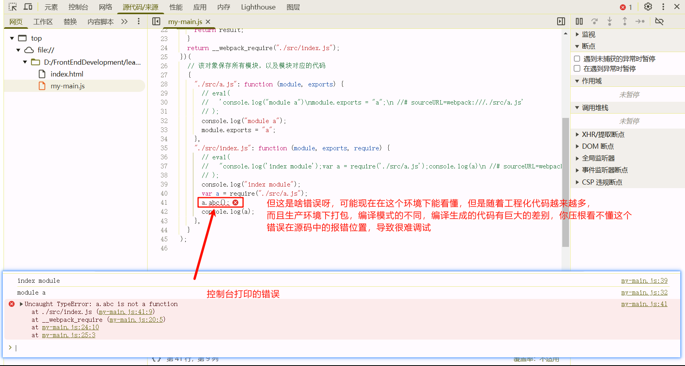
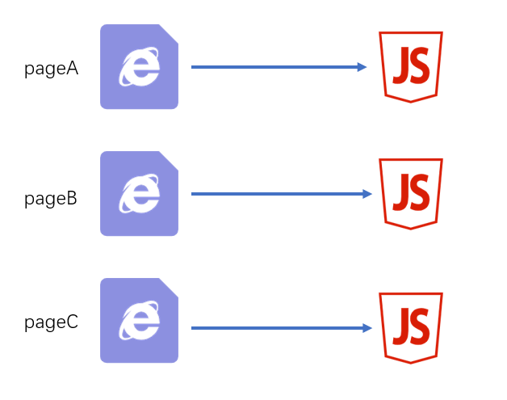
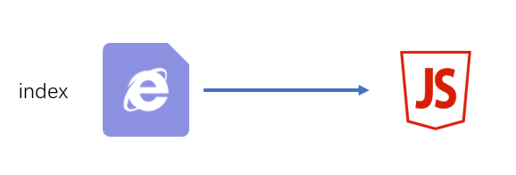
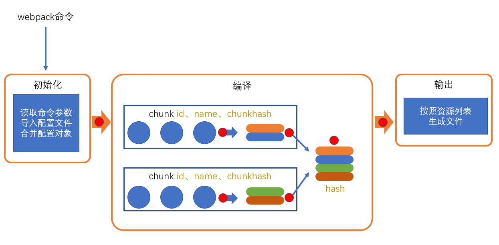

# 核心功能

## 浏览器端的模块化

对于前端工程来说，存在一些问题：

* 效率问题：我们开发时精细的模块划分带来了更多的JS文件，更多的JS文件带来了更多的请求，降低了页面访问效率
* 兼容性问题：浏览器目前仅支持ES6的模块化标准，并且还存在兼容性问题
* 工具问题：浏览器不支持npm下载的第三方包

这些仅仅是前端工程化的一个缩影

当开发一个具有规模的程序，你将遇到非常多的非业务问题，这些问题包括：执行效率、兼容性、代码的可维护性可扩展性、团队协作、测试等等等等，我们将这些问题称之为工程问题。工程问题与业务无关，但它深刻的影响到开发进度，如果没有一个好的工具解决这些问题，将使得开发进度变得极其缓慢，同时也让开发者陷入技术的泥潭。

:::tip 思考

上面提到的问题，为什么在node端没有那么明显，反而到了浏览器端变得如此严重呢？

答：在node端，运行的JS文件在本地，因此可以本地读取文件，它的效率比浏览器远程传输文件高的多

:::

#### 根本原因

在浏览器端，开发时态（devtime）和运行时态（runtime）的侧重点不一样

**开发时态，devtime：**

1. 模块划分越细越好
2. 支持多种模块化标准
3. 支持npm或其他包管理器下载的模块
4. 能够解决其他工程化的问题

**运行时态，runtime：**

1. 文件越少越好
2. 文件体积越小越好
3. 代码内容越乱越好
4. 所有浏览器都要兼容
5. 能够解决其他运行时的问题，主要是执行效率问题

这种差异在小项目中表现的并不明显，可是一旦项目形成规模，就越来越明显，如果不解决这些问题，前端项目形成规模只能是空谈

#### 解决办法

既然开发时态和运行时态面临的局面有巨大的差异，因此，我们需要有一个工具，这个工具能够让开发者专心的在开发时态写代码，然后利用这个工具将开发时态编写的代码转换为运行时态需要的东西。

这样的工具，叫做**构建工具**


:::info 2024年常用的构建工具

vite、esbuild、webpack、rollup、swc

:::

## 安装与使用

#### 首先webpack是什么呢？

webpack是基于模块化的打包（构建）工具，它把一切视为模块

它通过一个开发时态的入口模块为起点，分析出所有的依赖关系，然后经过一系列的过程（压缩、合并），最终生成运行时态的文件。

**特点：**

- **为前端工程化而生**：webpack致力于解决前端工程化，特别是浏览器端工程化中遇到的问题，让开发者集中注意力编写业务代码，而把工程化过程中的问题全部交给webpack来处理
- **简单易用**：支持零配置，可以不用写任何一行额外的代码就使用webpack
- **强大的生态**：webpack是非常灵活、可以扩展的，webpack本身的功能并不多，但它提供了一些可以扩展其功能的机制，使得一些第三方库可以融于到webpack中
- **基于nodejs**：由于webpack在构建的过程中需要读取文件，因此它是运行在node环境中的
- **基于模块化**：webpack在构建过程中要分析依赖关系，方式是通过模块化导入语句进行分析的，它支持各种模块化标准，包括但不限于CommonJS、ES6 Module

#### 安装

webpack通过npm安装，它提供了两个包：

- webpack：核心包，包含了webpack构建过程中要用到的所有api
- webpack-cli：提供一个简单的cli命令，它调用了webpack核心包的api，来完成构建过程

#### 使用

``````bash
webpack // 或者 npx webpack
``````

默认情况下，webpack会以 ``./src/index.js``作为入口文件分析依赖关系，打包到 ``./dist/main.js``文件中

通过--mode选项可以控制webpack的打包结果的运行环境

:::details 代码内容

请查看 `第1章/01-安装与使用`

可以看到webpack根据JavaScript的依赖关系以 ``./src/index.js``作为入口文件，打包到 ``./dist/main.js``文件

:::

## 模块兼容性

由于webpack同时支持CommonJS和ESM（ECMAScript Modules），因此需要理解它们互操作时webpack是如何处理的

#### 同模块标准

如果导出和导入使用的是同一个标准，打包后的效果和我们学习的模块化没有任何差异：


#### 不同模块化标准

不同模块化标准，webpack会按如下的方式处理：


#### 最佳实践

代码编写最忌讳的是精神分裂，选择一个合适的模块化标准，然后贯彻整个开发阶段。

::: details 代码内容

请查看：`第1章/02-模块兼容性`

在代码中我在 `./src/index.js`中引入了两种规范：

1. `./es6-a.js`使用的是ESMAScript Modules导出，在 `./src/index.js`导入这个文件使用的是CommonJS的语法
2. `./commonjs-b.js`使用的是CommonJS导出，在 `./src/index.js`导入这个文件使用的是ECMAScript Modules的语法

:::

## 编译结果分析

我们来看一下webpack打包的结果，以便理解的编译后的这部分JavaScript。

目录结构：

```
├─ 03-编译结果分析                 //
   ├─ dist                       //
   │  ├─ main.js                 // 打包后的文件
   └─ src                        //
      ├─ a.js                    // 入口文件依赖于a.js
      └─ index.js                // 入口文件
```

首先需要合并两个模块 `./src/a.js`和 `./src/index.js`，而每个模块也是一个函数，可以这么定义：

```javascript
// 该对象保存了所有的模块，以及模块对应的代码
var modules = {
    "./src/a.js": function(module, exports) {
        console.log("module a")
        module.exports = "a"
    },
    "./src/index.js": function(module, exports, require) {
        console.log("index module");
        // var a = require("./a"); 变成公共路径
        var a = require("./src/a.js");
        console.log(a);
    }
}
```

由于打包后的文件，不能有变量名来污染全局变量，实际上上面的对象是以一种参数的形式传递给一个匿名函数，那么匿名函数的逻辑是什么呢？下面我们用run函数来模拟这个匿名函数：

```javascript
function run(modules) {
    // 执行入口模块
    require("./src/index.js")
	// 相当于运行一个模块，得到模块导出的结果
    function require(moduleId) {
        var func = modules[moduleId] // 拿到modules对象中的moduleId对应的函数
        var module = {
            exports: {}
        }
        func(module, module.exports, require)
        // 如果有模块的导出结果，我们会去获取，并返回导出结果
        var result = module.exports;
        return result;
    }
}
```

为了防止运行多次，比如：重复运行 `require("./src/index.js")`的情况，我们可以定义一个缓存。

```javascript
function run(modules) {
    // 用于缓存模块的导出结果
    var moduleExports = {};
    // 执行入口模块，多次执行不会重复输出
    require("./src/index.js")
    require("./src/index.js")
    require("./src/index.js")
	// 相当于运行一个模块，得到模块导出的结果
    function require(moduleId) {
        if(moduleExports[moduleId]){
            // 检查是否有缓存
            return moduleExports[moduleId]
        }
  
        var func = modules[moduleId] // 拿到modules对象中的moduleId对应的函数
        var module = {
            exports: {}
        }
        func(module, module.exports, require)
        // 如果有模块的导出结果，我们会去获取，并返回导出结果
        var result = module.exports;
        // 缓存模块结果
        moduleExports[moduleId] = result; 
        return result;
    }
  
}
```

由于require不能和node.js环境中require声明是一样的，所以将require函数名变更为 `__webpack_require__`，于是我们整合一下：

```javascript
(function (modules) {
    // 用于缓存模块的导出结果
    var moduleExports = {};
    // 执行入口模块
    __webpack_require__("./src/index.js")
	// 相当于运行一个模块，得到模块导出的结果
    function __webpack_require__(moduleId) {
        if(moduleExports[moduleId]){
            // 检查是否有缓存
            return moduleExports[moduleId]
        }
        var func = modules[moduleId] // 拿到modules对象中的moduleId对应的函数
        var module = {
            exports: {}
        }
        func(module, module.exports, __webpack_require__)
        // 如果有模块的导出结果，我们会去获取，并返回导出结果
        var result = module.exports;
        // 缓存模块结果
        moduleExports[moduleId] = result; 
        return result;
    }
})(
    {
        "./src/a.js": function(module, exports) {
            console.log("module a")
            module.exports = "a"
        },
        "./src/index.js": function(module, exports, __webpack_require__) {
            console.log("index module");
            // var a = require("./a"); 变成公共路径
            var a = __webpack_require__("./src/a.js");
            console.log(a);
        }
    }
)
```

现在呢，我们再去看一下webpack在开发模式打包后的结果（同事把注释删除）：


你会发现除开eval和匿名函数的调用过程外，逻辑是一样的。

虽然用eval和直接指向代码一样，但为什么里面要用eval呢？

这个东西跟浏览器相关，如果打包后的代码报错了，在浏览器中不好调试。

比如说我在 `./src/index.js`中，加入一段错误代码 `a.abc()`，我们自己模拟的webpack打包文件（不用eval）在浏览器运行：



而当我们使用eval时，浏览器支持一个这样的情况，当使用eval时，浏览器会单独开一个虚拟机的环境来执行eval中的代码。下面是一个index.html引入JavaScript，JavaScript包含eval的代码，这段eval中的代码有错误，我们看一下编辑器中的JavaScript和浏览器的情况：


当我们在eval代码中写上这种注释：`//# sourceURL=xxx.js`时，在浏览器控制台报错产生了一点不同，那就是虚拟机的名称变成了 `xxx.js`，下面我们修改了 `test-eval.js`，变成 `eval("var a = 1;\na.abc();//# sourceURL=./test-eval.js");`，我们看一下浏览器：


发现上面看的到代码的具体报错位置了，在 `.test-eval.js`中。通过上面的例子，就明白了webpack为什么要用eval来执行模块内部的代码。

最终我们整合下最终的代码：

::: details 整合后最终代码

```javascript
(function (modules) {
    // 用于缓存模块的导出结果
    var moduleExports = {};
    // 执行入口模块
    __webpack_require__("./src/index.js")
	// 相当于运行一个模块，得到模块导出的结果
    function __webpack_require__(moduleId) {
        if(moduleExports[moduleId]){
            // 检查是否有缓存
            return moduleExports[moduleId]
        }
        var func = modules[moduleId] // 拿到modules对象中的moduleId对应的函数
        var module = {
            exports: {}
        }
        func(module, module.exports, __webpack_require__)
        // 如果有模块的导出结果，我们会去获取，并返回导出结果
        var result = module.exports;
        // 缓存模块结果
        moduleExports[moduleId] = result; 
        return result;
    }
})(
    {
        "./src/a.js": function(module, exports) {
            eval("console.log(\"module a\");\nmodule.exports = \"a\"//# sourceURL=./src/a.js")
        },
        "./src/index.js": function(module, exports, __webpack_require__) {
            eval("console.log(\"index module\");\nvar a = __webpack_require__(\"./src/a.js\");\nconsole.log(a);//# sourceURL=./src/index.js")
        }
    }
)
```

:::

::: details 代码内容

请查看：`03-编译结果分析`

`./dist/my-main.js`是模仿webpack编译后的打包文件的代码，以便理解原理

`./dist/test-eval.js`是测试eval，在浏览器调试的代码

:::

## 配置文件

webpack提供的cli支持很多的参数，例如 ``--mode``，但更多的时候，我们会使用更加灵活的配置文件来控制webpack的行为

默认情况下，webpack会读取 ``webpack.config.js``文件作为配置文件，但也可以通过CLI参数 ``--config``来指定某个配置文件

配置文件中通过CommonJS模块导出一个对象，对象中的各种属性对应不同的webpack配置

**基本配置：**

1. mode：编译模式，字符串，取值为development或production，指定编译结果代码运行的环境，会影响webpack对编译结果代码格式的处理
2. entry：入口，字符串（后续会详细讲解），指定入口文件
3. output：出口，对象（后续会详细讲解），指定编译结果文件

::: tip 注意

配置文件中的代码，必须是有效的node代码

当命令行参数与配置文件中的配置出现冲突时，以命令行参数为准。

:::

## devtool 配置

文档：[webpack - devtool](https://www.webpackjs.com/configuration/devtool/#devtool)

#### source map 源码地图

> 本小节的知识与 webpack 无关

前端发展到现阶段，很多时候都不会直接运行源代码，可能需要对源代码进行合并、压缩、转换等操作，真正运行的是转换后的代码


这就给调试带来了困难，因为当运行发生错误的时候，我们更加希望能看到源代码中的错误，而不是转换后代码的错误。

> jquery压缩后的代码：https://code.jquery.com/jquery-3.4.1.min.js

为了解决这一问题，chrome浏览器率先支持了source map，其他浏览器纷纷效仿，目前，几乎所有新版浏览器都支持了source map

source map实际上是一个配置，配置中不仅记录了所有源码内容，还记录了和转换后的代码的对应关系

下面是浏览器处理source map的原理


::: danger 🧐疑问

**编译结果分析**那节的eval不也能起到这样的效果吗？为什么要用source map这么技术呢？

你可以认为eval在浏览器中是一个简易版的source map（起到的效果是，但实际不是），它是给浏览器看的。

eval主要缺点是，由于会映射到转换后的代码，而不是映射到原始代码（没有从 loader 中获取 source map），所以不能正确的显示行数。

而source map没有这个缺点

:::

**最佳实践**：

1. source map 应在开发环境中使用，作为一种调试手段
2. source map 不应该在生产环境中使用，source map的文件一般较大，不仅会导致额外的网络传输，还容易暴露原始代码。即便要在生产环境中使用source map，用于调试真实的代码运行问题，也要做出一些处理规避网络传输和代码暴露的问题。

最佳实践webpack的文档里面也有说明：[开发环境](https://www.webpackjs.com/configuration/devtool/#development) | [生产环境](https://www.webpackjs.com/configuration/devtool/#production)

## 编译过程

webpack 的作用是将源代码编译（构建、打包）成最终代码


整个过程大致分为三个步骤

1. 初始化
2. 编译
3. 输出


#### 初始化

> 首先明白一点，使用webpack时需要用到webpack和webpack-cli这两个包，webpack这个包负责**模块打包**的核心逻辑，那么webpack-cli的作用是什么？
>
> webpack-cli 是 Webpack 的**命令行接口工具**，提供用户与 Webpack 交互的入口，让开发者通过配置文件来调用webpack的api进行**模块打包**，这中方式是为了提供友好的命令和提示。

此阶段，webpack-cli这个包会将**CLI参数**、**配置文件**、**默认配置**进行融合，形成一个最终的配置对象。

代码使用的webpack-cli处理版本是@6.0.1，它对配置的处理过程概述其下：

1. **CLI 参数解析**：通过 `commander` 解析用户输入的命令行参数。
2. **配置文件加载**：通过 `interpret/rechoir` 加载配置文件（如 `webpack.config.js`）。
3. **配置合并**：使用 `webpack-merge` 将 CLI 参数、配置文件、默认配置合并为最终对象。
4. **配置验证**：通过内部逻辑或 `@webpack-cli/configtest` 检查配置合法性。

#### 编译

1. **创建chunk**

   chunk是webpack在内部构建过程中的一个概念，译为 ``块``，它表示通过某个入口找到的所有依赖的统称。

   根据入口模块（默认为 ``./src/index.js``）创建一个chunk

   

   每个chunk都有至少两个属性：

   - name：默认为main
   - id：唯一编号，开发环境和name相同，生产环境是一个数字，从0开始
2. **构建所有依赖模块**
   

   > AST在线测试工具：https://astexplorer.net/
   >

   简图：

   
3. 合并chunk assets，将多个chunk的assets合并到一起，并产生一个总的hash

    

#### 输出

此步骤非常简单，webpack将利用node中的fs模块（文件处理模块），根据编译产生的总的assets，生成相应的文件。


#### 总过程


::: tip 涉及术语

1. `module`：模块，分割的代码单元，webpack中的模块可以是任何内容的文件，不仅限于JS
2. `chunk`：webpack内部构建模块的块，一个chunk中包含多个模块，这些模块是从入口模块通过依赖分析得来的
3. `bundle`：chunk构建好模块后会生成chunk的资源清单，清单中的每一项就是一个bundle，可以认为bundle就是最终生成的文件
4. `hash`：最终的资源清单所有内容联合生成的hash值
5. `chunkhash`：chunk生成的资源清单内容联合生成的hash值
6. `chunkname`：chunk的名称，如果没有配置则使用main
7. `id`：通常指chunk的唯一编号，如果在开发环境下构建，和chunkname相同；如果是生产环境下构建，则使用一个从0开始的数字进行编号

:::

## 入口和出口

这里指的入口和出口是相对于配置文件来说的（`webpack.config.js`）

**出口**: 这里的出口是针对资源列表的文件名或路径的配置，出口通过 `output`进行配置

**入口**: 入口真正配置的是chunk，入口通过 `entry`进行配置

::: details 代码内容

请查看：`07-入口和出口`

里面有更多内容，这里不做解释

`output`中 `filename`的[?]规则：

- `name`：chunkname
- `hash`: 总（chunk）的资源hash，通常用于解决缓存问题
- `chunkhash`: 整个chunk的内容生成的hash（比如说：一个chunk下的JavaScript和CSS等资源使用同一个hash）
- `contenthash`：单个文件的内容生成的hash（比如说：一个chunk下的JavaScript和CSS等资源使用各自内容的hash）
- `id`: 使用chunkid，不推荐

:::

#### 入口和出口的最佳实践

具体情况具体分析，下面是一些经典场景：

* 一个页面一个JS

  

  源码结构

  ```
  |—— src
      |—— pageA   页面A的代码目录
          |—— index.js 页面A的启动模块
          |—— ...
      |—— pageB   页面B的代码目录
          |—— index.js 页面B的启动模块
          |—— ...
      |—— pageC   页面C的代码目录
          |—— main1.js 页面C的启动模块1 例如：主功能
          |—— main2.js 页面C的启动模块2 例如：实现访问统计的额外功能
          |—— ...
      |—— common  公共代码目录
          |—— ...
  ```

  webpack配置

  ```javascript
  module.exports = {
      entry:{
          pageA: "./src/pageA/index.js",
          pageB: "./src/pageB/index.js",
          pageC: ["./src/pageC/main1.js", "./src/pageC/main2.js"]
      },
      output:{
          filename:"[name].[chunkhash:5].js"
      }
  }
  ```

  这种方式适用于页面之间的功能差异巨大、公共代码较少的情况，这种情况下打包出来的最终代码不会有太多重复。
* 一个页面多个JS

  

  源码结构

  ```
  |—— src
      |—— pageA   页面A的代码目录
          |—— index.js 页面A的启动模块
          |—— ...
      |—— pageB   页面B的代码目录
          |—— index.js 页面B的启动模块
          |—— ...
      |—— statistics   用于统计访问人数功能目录
          |—— index.js 启动模块
          |—— ...
      |—— common  公共代码目录
          |—— ...
  ```

  webpack配置

  ```javascript
  module.exports = {
      entry:{
          pageA: "./src/pageA/index.js",
          pageB: "./src/pageB/index.js",
          statistics: "./src/statistics/index.js"
      },
      output:{
          filename:"[name].[chunkhash:5].js"
      }
  }
  ```

  这种方式适用于页面之间有一些**独立**、相同的功能，专门使用一个chunk抽离这部分JS有利于浏览器更好的缓存这部分内容。

  ::: tip 思考

  为什么不使用多启动模块的方式？

  :::
* 单页应用

  所谓单页应用，是指整个网站（或网站的某一个功能块）只有一个页面，页面中的内容全部靠JS创建和控制。 vue和react都是实现单页应用的利器。

  

  源码结构

  ```
  |—— src
      |—— subFunc   子功能目录
          |—— ...
      |—— subFunc   子功能目录
          |—— ...
      |—— common  公共代码目录
          |—— ...
      |—— index.js
  ```

  webpack配置

  ```javascript
  module.exports = {
      entry: "./src/index.js",
      output:{
          filename:"index.[hash:5].js"
      }
  }
  ```

## loader

:::info 更多的功能？

webpack做的事情，仅仅是分析出各种模块的依赖关系，然后形成资源列表，最终打包生成到指定的文件中。
更多的功能需要借助webpack loaders和webpack plugins完成。

:::

下面说一下loader的作用：

在webpack中loader本质上是一个函数，它的作用是将某个源码字符串转换成另一个源码字符串返回。


loader是在chunk解析的流程中运行的：


处理loader的流程：


:::details 代码内容

有关loader的具体使用请看 `08-loader`

1. `./src/index.js`是一个入口文件，但是里面的是JavaScript语法不正确的代码
2. `empty.config.js`是一个空的配置文件，作用是为了对比没有使用loader时，编译后的代码
3. `webpack.config.js`是适用loader的配置文件，一方面是为了对比没有使用loader时，对代码的处理，另一方面可以看到loader的配置怎么使用

:::

## plugin

loader的功能定位是转换代码，而一些其他的操作难以使用loader完成，比如：

- 当`webpack`生成文件时，顺便多生成一个说明描述文件
- 当`webpack`编译启动时，控制台输出一句话表示`webpack`启动了
- 当xxxx时，xxxx

这种类似的功能需要把功能嵌入到`webpack`的编译流程中，而这种事情的实现是依托于`plugin`的



plugin的**本质**是一个带有apply方法的对象

```javascript
var plugin = {
    apply: function(compiler){
        
    }
}
```

通常，习惯上，我们会将该对象写成构造函数的模式

```javascript
class MyPlugin{
    apply(compiler){

    }
}
let plugin = new MyPlugin();
```

要将插件应用到webpack，需要把插件对象配置到webpack的plugins数组中，如下：

```js
module.exports = {
    plugins:[
        new MyPlugin()
    ]
}
```

apply函数会在初始化阶段，创建好Compiler对象后运行。

compiler对象是在初始化阶段构建的，整个webpack打包期间只有一个compiler对象，后续完成打包工作的是compiler对象内部创建的compilation

apply方法会在**创建好compiler对象后调用**，并向方法传入一个compiler对象


compiler对象提供了大量的钩子函数（hooks，可以理解为事件），plugin的开发者可以注册这些钩子函数，参与webpack编译和生成。

你可以在apply方法中使用下面的代码注册钩子函数:

```js
class MyPlugin{
    apply(compiler){
        compiler.hooks.事件名称.事件类型(name, function(compilation){
            //事件处理函数
        })
    }
}
```

**事件名称**

即要监听的事件名，即钩子名，所有的钩子：https://www.webpackjs.com/api/compiler-hooks

**事件类型**

这一部分使用的是 Tapable API，这个小型的库是一个专门用于钩子函数监听的库。// 可能不对！！！

它提供了一些事件类型：

- tap：注册一个同步的钩子函数，函数运行完毕则表示事件处理结束
- tapAsync：注册一个基于回调的异步的钩子函数，函数通过调用一个回调表示事件处理结束
- tapPromise：注册一个基于Promise的异步的钩子函数，函数通过返回的Promise进入已决状态表示事件处理结束

**处理函数**

处理函数有一个事件参数```compilation```

comlilation的钩子：https://www.webpackjs.com/api/compilation-hooks/

:::detail 代码内容

有关plugin的内容请查看`09-plugin`

:::

## 区分环境

有些时候，我们需要针对生产环境和开发环境分别书写webpack配置

为了更好的适应这种要求，webpack允许配置不仅可以是一个对象，还可以是一个**函数**

```js
module.exports = env => {
    return {
        //配置内容
    }
}
```

在开始构建时，webpack如果发现配置是一个函数，会调用该函数，将函数返回的对象作为配置内容，因此，开发者可以根据不同的环境返回不同的对象

在调用webpack函数时，webpack会向函数传入一个参数env，该参数的值来自于webpack命令中给env指定的值，例如

```shell
npx webpack --env abc # env: "abc"

npx webpack --env.abc # env: {abc:true}
npx webpack --env.abc=1  # env： {abc:1}
npx webpack --env.abc=1 --env.bcd=2 # env: {abc:1, bcd:2}
```

这样一来，我们就可以在命令中指定环境，在代码中进行判断，根据环境返回不同的配置结果。
