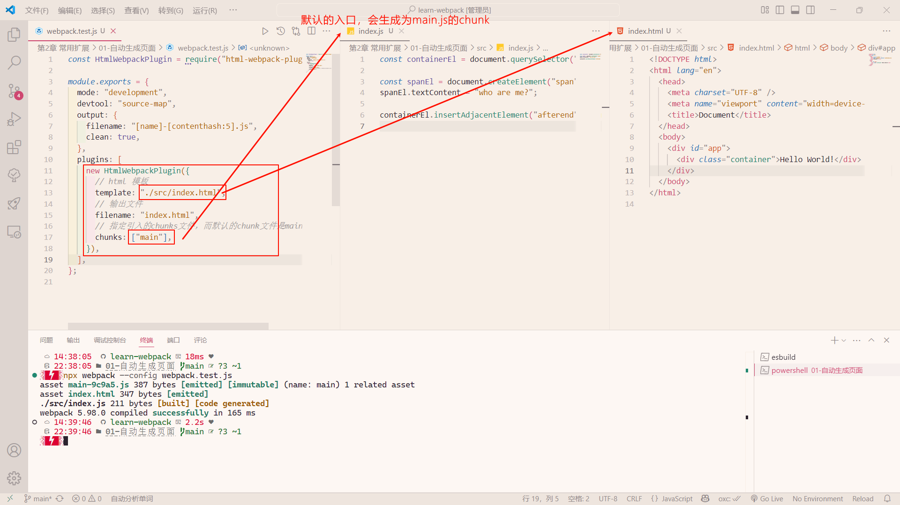
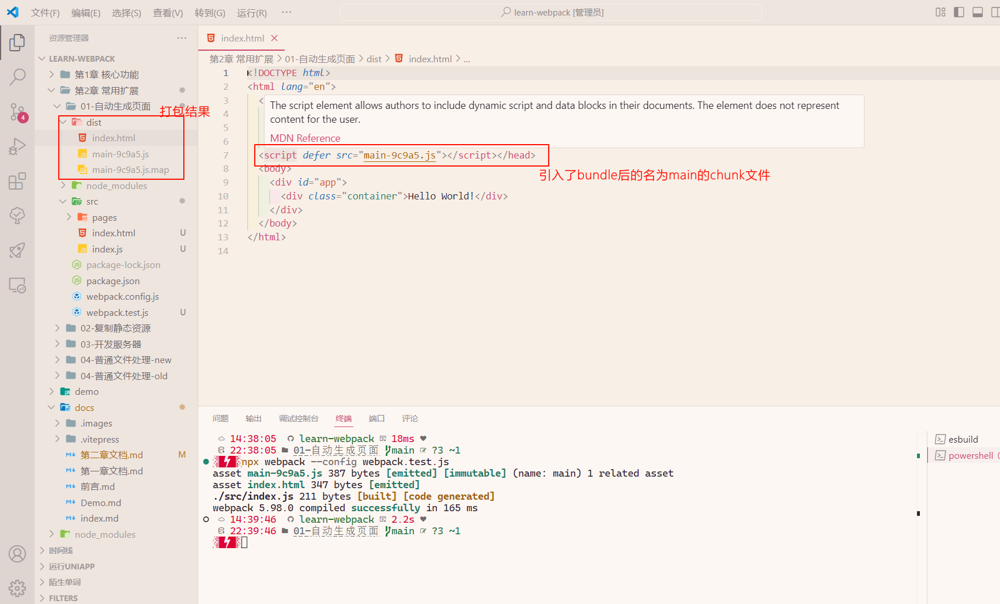
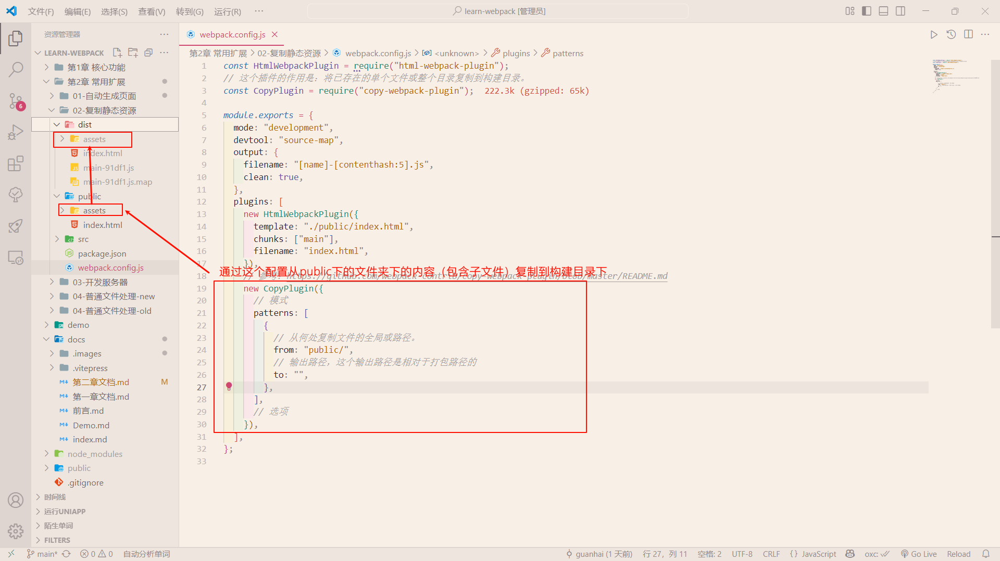

# 常用扩展

## 自动生成页面

自动生成页面的功能依靠于`webpack`的一个插件（plugin）：[`html-webpack-plugin`](https://github.com/jantimon/html-webpack-plugin)

具体作用是：简化HTML文件的创建，为您的`webpack` bundle文件提供服务。

安装它：

```bash
pnpm add -D html-webpack-plugin // npm install -D html-webpack-plugin
```

在这里不探究它的原理，下面来看是具体代码中的作用：

配置部分的使用 =>



打包后的结果 =>



所以该plugin的作用就是：指定一个html模板和chunk文件，在webpack打包后能够让html内联chunk文件（chunk文件可以是一个或者多个JavaScript文件）

:::details 代码内容

上图示例可参考该章节的`01-自动生成页面`的webpack.test.js

但webpack.config.js的示例可以使用多个实例来生成多个html内联chunk文件

:::

## 复制静态资源

复制静态资源的功能依靠于webpack的一个插件：[`copy-webpack-plugin`](https://github.com/webpack-contrib/copy-webpack-plugin)

具体作用是：将已存在的单个文件或整个目录复制到构建目录。



上面这个示例中我将/public下assets文件夹（里面的图片）复制到构建目录中

:::details 代码内容

上图示例可参考该章节的`02-复制静态资源`

配置请查看示例的注释，更多信息请查看该插件的文档

:::

## 开发服务器

在**开发阶段**，目前遇到的问题是打包、运行、调试过程过于繁琐，回顾一下我们的操作流程：

1. 编写代码
2. 控制台运行命令完成打包
3. 打开页面查看效果
4. 继续编写代码，回到步骤2

并且，我们往往希望把最终生成的代码和页面部署到服务器上，来模拟真实环境

为了解决这些问题，webpack官方制作了一个单独的库：[`webpack-dev-server`](https://github.com/webpack/webpack-dev-server)

它**既不是plugin也不是loader**

### 使用

1. 安装

   ```bash
   pnpm add -D webpack-dev-server
   ```

2. 添加其webpack的配置文件的配置

   下面的`devServer`就是webpack-dev-server的配置，下面指定了服务器监听请求的端口号、指定了网页所需要的静态文件、指定要使用的 host、指定代理的URL:

   ```javascript
   const HtmlWebpackPlugin = require("html-webpack-plugin");
   const path = require("path");
   module.exports = {
     mode: "development",
     devtool: "source-map",
     output: {
       filename: "[name]-[contenthash:5].js",
       clean: true,
     },
     plugins: [
       new HtmlWebpackPlugin({
         template: "./public/index.html",
       }),
     ],
     // 参考：https://www.webpackjs.com/configuration/dev-server/ // [!code ++]
     devServer: { // [!code ++]
       port: 8000, // [!code ++]
       static: { // [!code ++]
         directory: path.resolve(__dirname, "public"), // [!code ++]
       }, // [!code ++]
       host: "local-ip", // [!code ++]
       // 参考：https://www.webpackjs.com/configuration/dev-server/#devserverproxy // [!code ++]
       proxy: [ // [!code ++]
         { // [!code ++]
           context: ["/api"], // [!code ++]
           target: "https://api.vvhan.com", // [!code ++]
           changeOrigin: true, // [!code ++]
         }, // [!code ++]
       ], // [!code ++]
     }, // [!code ++]
     stats: "minimal",
   };
   ```

3. 执行```webpack-dev-server```命令

   ```bash
   npx webpack-dev-server // 方式一：使用其API
   npx webpack serve // 方式二：使用CLI
   ```

```webpack-dev-server```命令几乎支持所有的webpack命令参数，如```--config```、```-env```等等，你可以把它当作webpack命令使用

这个命令是专门为开发阶段服务的，真正部署的时候还是得使用webpack命令

### 机制

当我们执行```webpack-dev-server```命令后，它做了以下操作：

1. 内部执行webpack命令，传递命令参数
2. 开启watch
3. 注册hooks：类似于plugin，webpack-dev-server会向webpack中注册一些钩子函数，主要功能如下：
   1. 将资源列表（aseets）保存起来
   2. 禁止webpack输出文件
4. 用express开启一个服务器，监听某个端口，当请求到达后，根据请求的路径，给予相应的资源内容

:::details 代码内容

上述示例的webpack配置文件来源于`03-开发服务器`。

在该仓库中可以思考下为什么要用`html-webpack-plugin`呢？或许可以通过bundle来试一下（npx webpack）

:::
